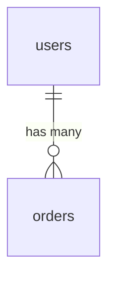

# Wiki Compilation Rules

How to compile raw sources into wiki pages. Read this during `/wiki-ingest`.

## Page Types

| Type | When to use | Word target |
|---|---|---|
| `concept` | Dense explanation of an idea, technique, or architecture | 400-1200 |
| `entity` | Factual summary of a person, tool, paper, or org | 200-500 |
| `summary` | Key takeaways from a single source | 150-400 |
| `index` | Navigation hub for a topic | 150-400 |
| `lecture` | Takeaways from audio/video content | 300-800 |
| `claim` | Trackable assertion with evidence and confidence | 100-400 |
| `synthesis` | Query-derived comparison or analysis (from /wiki-promote) | 300-1200 |

## Required Frontmatter

Every wiki page MUST have:

```yaml
---
title: Page Title
type: concept
tags: [authentication, jwt, session-management]
sources: [raw/auth/overview.md]
created: 2026-04-12
updated: 2026-04-12
quality: 0.0
summary: >
  Two to three line abstract used for progressive disclosure.
  This appears in summaries.md for scanning without loading the full page.
---
```

### Additional frontmatter for claims

```yaml
status: proposed                   # proposed | supported | challenged | deprecated
confidence: 0.6                   # 0.0-1.0
failure_reason: ""                 # REQUIRED when status=deprecated
evidence:
  - source: raw/topic/paper.md
    type: supports
    strength: moderate
    detail: "..."
```

### Additional frontmatter for code references (code locality)

```yaml
references:
  - path: src/auth/session.py
    lines: [42, 58]
    symbol: authenticate
    content_hash: e3b0c44298fc...
```

## Link Enrichment

Before compiling a page, load ~300 characters from the top 2-3 linked pages as context. This produces better cross-references and catches contradictions at write time.

## Cross-Referencing During Compilation

When multiple source agents are active, their outputs are collected and woven into a single compilation prompt. The page should reference all contributing sources and note where they agree or conflict.

## "How to Go Deeper" Section

For pages with external source references, auto-generate:

```markdown
## How to Go Deeper

- **Database:** `wiki agent db-query dev "SELECT ... FROM ..."`
- **Jira:** `wiki agent jira --query "project = AUTH AND ..."`
- **Live code:** Read `src/auth/session.py:42-58`
```

Map source types to agent commands. Skip for pages compiled only from local files.

## Graph Edges

After compilation, write typed relationships to `graph/edges.jsonl`:

- `supports` — evidence supports a claim or concept
- `contradicts` — evidence contradicts existing knowledge
- `extends` — builds on or refines an existing concept
- `supersedes` — replaces an older method or claim

Every edge MUST carry a provenance tag:
- `EXTRACTED` — direct source evidence (implicit confidence 1.0)
- `INFERRED` — reasonable deduction (include `provenance_score` 0.0-1.0)
- `AMBIGUOUS` — uncertain, flagged for human review

## Claims Extraction

During compilation, extract trackable assertions:
- Create/update pages in `wiki/claims/`
- Link claims to source pages via edges.jsonl
- Set initial confidence based on evidence strength

## Tag Rules

Tags represent concepts, theories, and models ONLY:
- Named theories: `ELM-model`, `transformer-architecture`
- Core subjects: `consumer-behavior`, `distributed-systems`
- Specific techniques: `A-B-testing`, `gradient-descent`
- Cross-cutting themes on 2+ pages

Tags to EXCLUDE:
- Page-type tags: `concept`, `entity` (the `type` field handles this)
- Numbering: `chapter-5`, `section-3`
- Temporal: `april-2026`, `Q2-2026`
- Generic metadata: `important`, `reference`, `draft`

Target: 4-8 concept tags per page.

## Mermaid Diagrams

Generate Mermaid diagrams inline when the source data is structural:
- `erDiagram` for database entity relationships
- `sequenceDiagram` for request flows
- `graph TB` for service topology or architecture
- `classDiagram` for ORM entities
- `graph LR` for dependency graphs

Wrap in fenced code blocks:
````markdown

````
