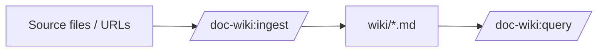

# doc-wiki

> A documentation wiki generator and maintainer that runs entirely as Claude Code skills, agents, and TypeScript helpers. Point it at a codebase, your Jira/Confluence/Notion/GitHub, and your databases — get a structured, queryable, self-healing wiki you can grow over time.

doc-wiki is **a tool you run inside Claude Code** (or Codex / Gemini / Cursor / Aider — see [multi-platform wrappers](#multi-platform-wrappers)). Ten `/doc-wiki:*` slash commands cover the full lifecycle: bootstrap, atlas (full-codebase documentation in one pass), ingest, query, lint, fix, refresh, and cross-link the wiki as your project evolves. External services are reached through a single planner — `gather()` from [`narai-primitives`](https://github.com/narailabs/narai-primitives) — so you configure credentials once and every command can use them.

## What it is good for

- Generating project documentation from a mix of code, README files, design docs, Jira tickets, Confluence pages, GitHub issues, and (read-only) database schemas.
- Maintaining a per-repo knowledge base that survives refactors — content-hash drift detection flags pages whose source code has moved.
- Mapping ORM entities (JPA, SQLAlchemy, Django, Prisma, TypeORM, ActiveRecord, Entity Framework) to live database tables and emitting Mermaid ER diagrams.
- Keeping `CLAUDE.md` (and per-submodule `CLAUDE.md` files) in sync with the wiki.
- Letting you `/doc-wiki:query` instead of `grep`-ing through stale files.

## What it is **not**

- A standalone server or web app. There is no daemon, no UI, no cloud — it lives in your terminal under Claude Code.
- A replacement for code comments or upstream documentation. It complements them.
- A write-back tool for external services. Every connector is **read-only**; the `db` connector ships with a policy gate (`ALLOW` / `DENY` / `ESCALATE` / `PRESENT_ONLY`).

## Prerequisites

- **Node 20.x.** Node 21+ isn't supported because some upstream deps (`better-sqlite3`, `pdfjs-dist`) haven't shipped Node-21 binaries. Check with `node --version`; install via `nvm install 20` if needed.
- **Claude Code, Codex, Gemini, Cursor, or Aider** to invoke the slash commands. doc-wiki ships wrappers for each — see [Multi-platform wrappers](#multi-platform-wrappers).
- **Optional:** credentials for any external services you want doc-wiki to read from (Jira, Confluence, GitHub, Notion, AWS, GCP, or a database). You can skip these now and add them later via `/doc-wiki:onboard`.

## Install

<!-- wiki-managed: quickstart start -->
**From zero to a queryable wiki in ~5 minutes.**

### 1. Scaffold

```
/doc-wiki:init
```

Creates `wiki.config.yaml` and the wiki directory tree under `docs/<app-name>-wiki/`.

### 2. Onboard

```
/doc-wiki:onboard
```

Six-phase setup: detects stack, ORM, database, external services (Jira / Confluence / GitHub / Notion / AWS / GCP), autonomy mode, and installs hooks. Idempotent.

### 3. Ingest or Atlas

```
/doc-wiki:ingest README.md                             # single source
/doc-wiki:ingest https://my-org.atlassian.net/PROJ-1   # Jira ticket
/doc-wiki:atlas --dry-run                              # full-codebase plan
/doc-wiki:atlas                                        # full-codebase commit
```

### 4. Query

```
/doc-wiki:query "How does the cache work?"
```

Returns a cited answer synthesised from wiki pages. Archives to `outputs/queries/`; promote with `/doc-wiki:promote last`.

Full walkthrough → [docs/doc-wiki-wiki/wiki/getting-started.md](docs/doc-wiki-wiki/wiki/getting-started.md)
<!-- wiki-managed: quickstart end -->

### From the NarAI marketplace (recommended)

doc-wiki ships as a [Claude Code plugin](https://github.com/narailabs/narai-claude-plugins). One-time marketplace setup, then install:

```sh
claude plugin marketplace add narailabs/narai-claude-plugins
claude plugin install doc-wiki@narai
```

After install, the ten `/doc-wiki:*` slash commands are available in every Claude Code session — no per-project clone, no per-project build.

### Direct from GitHub (no marketplace)

```sh
claude plugin install narailabs/doc-wiki
```

### From source (contributors only)

```sh
git clone https://github.com/narailabs/doc-wiki.git
cd doc-wiki
npm install
npm run build
```

The TypeScript scripts compile to sibling `.js` files; the plugin layout under `commands/`, `skills/doc-wiki/`, and `agents/` is what Claude Code picks up after `claude plugin install --local <path>`. See [`CONTRIBUTING.md`](CONTRIBUTING.md) for the dev loop.

## First run

Open the project you want to document in Claude Code. The four-command happy path takes ~5 minutes; you'll have a queryable wiki by the end.

### 1. Scaffold

```text
/doc-wiki:init
```

Creates `wiki.config.yaml` and the wiki directory tree (defaults to `docs/<app-name>-wiki/`):

```
<wiki-root>/
├── wiki.config.yaml
├── wiki/                    # compiled pages live here
├── raw/                     # raw fetched sources (cached)
├── graph/edges.jsonl        # typed relationships
├── log/events.jsonl         # operation event stream
├── outputs/queries/         # archived /doc-wiki:query answers
└── .wiki-cache/             # SHA256 dedup cache
```

For the full anatomy, see [`docs/wiki-output.md`](docs/wiki-output.md).

### 2. Onboard

```text
/doc-wiki:onboard
```

Six interactive phases that detect and configure the project:

1. **Language / framework** — reads `package.json`, `pyproject.toml`, `go.mod`, `Cargo.toml`, etc.
2. **ORM** — scans for entity definitions (Prisma, SQLAlchemy, Django, JPA, TypeORM, ActiveRecord, Entity Framework).
3. **Database** — reads `docker-compose.yml`, `.env`, ORM config; redacts credentials before showing.
4. **External services** — six yes/no questions (Jira, Confluence, GCP, AWS, Notion, GitHub).
5. **Connector access** — for every "yes" above, asks one credential question and writes a starter `~/.connectors/config.yaml`.
6. **Autonomy mode** — pick `conservative` / `balanced` / `autonomous` / `auto`. Default `balanced` is right for most cases. See [`docs/autonomy-modes.md`](docs/autonomy-modes.md).

**Onboard is idempotent** — re-run any time the project changes.

### 3. Wire up your first connector (optional, takes 2 minutes)

If you want to ingest from external services, configure at least one connector. The smallest example uses GitHub via an environment variable.

Edit `~/.connectors/config.yaml` (created by onboard) and uncomment the GitHub block:

```yaml
connectors:
  github:
    enabled: true
    skill: github-agent-connector
    token: env:GITHUB_TOKEN
```

Set the env var in your shell rc (`~/.zshrc`, `~/.bashrc`):

```sh
export GITHUB_TOKEN=ghp_xxx_your_personal_access_token
```

Reload your shell (or `source` the rc file). That's it — `gather()` will lazy-resolve `env:GITHUB_TOKEN` inside the connector subprocess on every ingest from a `github.com` URL.

Other credential ref forms work too — `keychain:LABEL`, `file:/abs/path`, `cloud:aws-secret/<arn>`, `cloud:gcp-secret/<resource>`. See [`docs/configuration.md` § credential reference grammar](docs/configuration.md#credential-reference-grammar) for all five and [`docs/connectors.md`](docs/connectors.md) for the credential block per connector.

If you only ingest local files, **skip this step** — every connector is opt-in and the example file ships with all of them commented out.

### 4. Ingest your first source

Pick something small. Your `README.md` is a natural starting point:

```text
/doc-wiki:ingest README.md
```

Behind the scenes, doc-wiki runs a 13-step pipeline: SHA256 cache check → security validation → source extraction → entity surface → `gather()` for related external context → page compilation → Mermaid augmentation → "How to Go Deeper" generation → index/summaries update → event log → crosslink + tag-harmonize.

The result is a compiled wiki page with frontmatter, narrative, optional Mermaid diagrams, and a "How to Go Deeper" footer. A truncated example:

````markdown
---
title: doc-wiki — Documentation Wiki Generator
type: concept
tags: [documentation, knowledge-base, claude-code, narai-primitives]
sources: [README.md]
created: 2026-05-07
updated: 2026-05-07
quality: 0.78
summary: >
  doc-wiki is a Claude Code plugin that generates and maintains a wiki...
---

# doc-wiki

doc-wiki is a documentation wiki generator that runs entirely inside
Claude Code as skills + agents + TypeScript helpers...



## How to Go Deeper

- **Live source:** [`README.md`](../../README.md)
- **All commands:** see `docs/commands.md`
````

For the full page anatomy, see [`docs/wiki-output.md`](docs/wiki-output.md).

### 5. Ask a question

```text
/doc-wiki:query "what does this project do?"
```

Returns a synthesized answer with inline citations to wiki pages. The full transcript is archived under `wiki/outputs/queries/<timestamp>.md` so you can `/doc-wiki:promote` it into a permanent page later.

After three or four `/doc-wiki:ingest` (or one `/doc-wiki:atlas`), `/doc-wiki:query` becomes the way you look things up — cheaper than re-reading source, more durable than chat history.

### Comprehensive bootstrap with `/doc-wiki:atlas`

If running `/doc-wiki:ingest` five or ten times by hand feels tedious:

```text
/doc-wiki:atlas --dry-run    # show plan + cost estimate, no writes
/doc-wiki:atlas              # commit
```

Atlas auto-discovers topics, batches ingest across `(topic × facet)` pairs, and synthesizes 3–7 global pages (`overview.md`, `integrations.md`, `deploy.md`, etc.). Default `--max-cost` is `$200`; override with `--max-cost 50` or `--scope <topic>` for narrower runs. See [`docs/atlas.md`](docs/atlas.md).

## Common pitfalls

| Symptom | Likely cause | Fix |
|---|---|---|
| `npm install` fails with `EBADENGINE` | Node 21+ | Switch to Node 20 (`nvm install 20 && nvm use 20`) |
| `Cannot find module '<script>.js'` | Forgot `npm run build` after source clone | Run `npm install && npm run build` once |
| `gather()` returns empty plan | Connector not enabled, env var unset, or source mentions nothing dispatchable | Inspect `~/.connectors/config.yaml` and verify `echo $GITHUB_TOKEN` (etc.) is non-empty |
| `/doc-wiki:query` returns "no relevant pages" | Wiki is too sparse | Run a few more `/doc-wiki:ingest` (or one `/doc-wiki:atlas`) |
| `npm test` shows 5 skipped | Live-DB integration tests gated behind `TEST_LIVE_*` env vars | Normal — set the vars only if you need them |

Full diagnostics: [`docs/troubleshooting.md`](docs/troubleshooting.md).

## What's in the box

- **10 slash commands** — `/doc-wiki:init`, `:onboard`, `:atlas`, `:ingest`, `:query`, `:lint`, `:fix`, `:promote`, `:refresh`, `:stats`. See [`docs/commands.md`](docs/commands.md).
- **3 sub-agents** — `wiki-orm-agent` (entity-to-table mapping), `wiki-mermaid-agent` (deterministic diagram generation), `wiki-claude-md-agent` (`CLAUDE.md` maintenance with managed sections).
- **7 connectors via `narai-primitives`** — `db` / `github` / `jira` / `confluence` / `notion` / `aws` / `gcp`. All read-only. Credentials resolved inside the connector subprocess via `narai-primitives/credentials` (env var / keychain / file / cloud secret).
- **4 autonomy modes** — `conservative` / `balanced` / `autonomous` / `auto`, with per-category overrides for fine-grained control.
- **18 REST framework profiles** — atlas auto-detects HTTP endpoints from Express, FastAPI, Django, Spring, Rails, ASP.NET, and 12 more. Custom profiles via inline YAML.
- **934 vitest tests** (5 skipped, gated behind `TEST_LIVE_*` env vars).

## Documentation

Documentation under [`docs/`](docs/) is organized by audience:

### Get started

| Doc | When to read |
|---|---|
| [`docs/getting-started.md`](docs/getting-started.md) | Step-by-step tutorial — install through maintenance loop |
| [`docs/recipes.md`](docs/recipes.md) | Common end-to-end command sequences for typical jobs |
| [`docs/wiki-output.md`](docs/wiki-output.md) | What your wiki looks like after first ingest |
| [`docs/faq.md`](docs/faq.md) | Anticipated common questions |

### Reference

| Doc | When to read |
|---|---|
| [`docs/commands.md`](docs/commands.md) | Every `/doc-wiki:*` command — args, examples |
| [`docs/configuration.md`](docs/configuration.md) | `wiki.config.yaml` and `.connectors/config.yaml` schemas, credential grammar |
| [`docs/connectors.md`](docs/connectors.md) | The 7 built-in connectors and credentials |
| [`docs/atlas.md`](docs/atlas.md) | The eight-phase `/doc-wiki:atlas` walkthrough |
| [`docs/autonomy-modes.md`](docs/autonomy-modes.md) | When to pick conservative / balanced / autonomous / auto |
| [`docs/troubleshooting.md`](docs/troubleshooting.md) | Common failures and fixes |

### Advanced

| Doc | When to read |
|---|---|
| [`docs/rest-profiles.md`](docs/rest-profiles.md) | Author custom REST profiles for atlas Phase 1b |

### Contributor reference

| Doc | When to read |
|---|---|
| [`docs/internals/architecture.md`](docs/internals/architecture.md) | Three-layer model, ingest pipeline, invariants |
| [`docs/internals/connectors-api.md`](docs/internals/connectors-api.md) | `gather()` API, toolkit, error codes, contributing a built-in connector |
| [`CONTRIBUTING.md`](CONTRIBUTING.md) | Dev setup, test loop, where things live |

## Multi-platform wrappers

doc-wiki is primarily a Claude Code project, but the same skill is exposed in other AI coding tools via these wrappers:

| File | Tool |
|---|---|
| [`AGENTS.md`](AGENTS.md) | Codex / OpenAI agents |
| [`GEMINI.md`](GEMINI.md) | Gemini / Google AI |
| [`.cursor/rules/doc-wiki.mdc`](.cursor/rules/doc-wiki.mdc) | Cursor IDE |
| [`.aider/conventions.md`](.aider/conventions.md) | Aider |

All four route into the same orchestrator skill. Slash commands work the same; only the prompt UI differs.

## License

doc-wiki is released under the [Apache License 2.0](LICENSE).

## Contributing

See [`CONTRIBUTING.md`](CONTRIBUTING.md). PRs welcome; please run `npm test` and `npm run typecheck` before opening one.

## Status

This is a 0.1.x project under active development. Architecture contracts are stable (see [`docs/internals/architecture.md`](docs/internals/architecture.md)) but the surface API may evolve.
