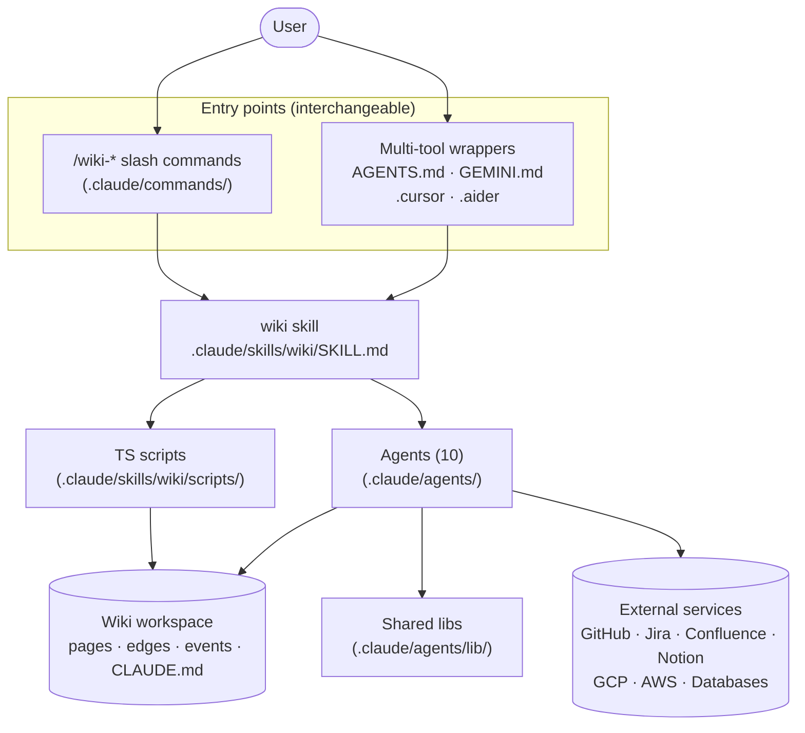
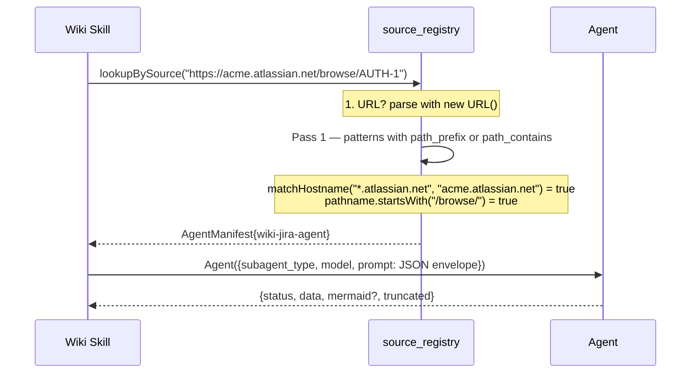
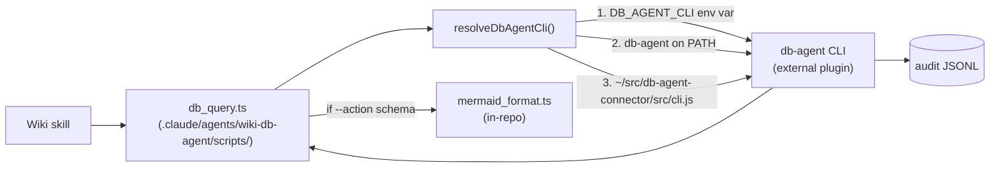
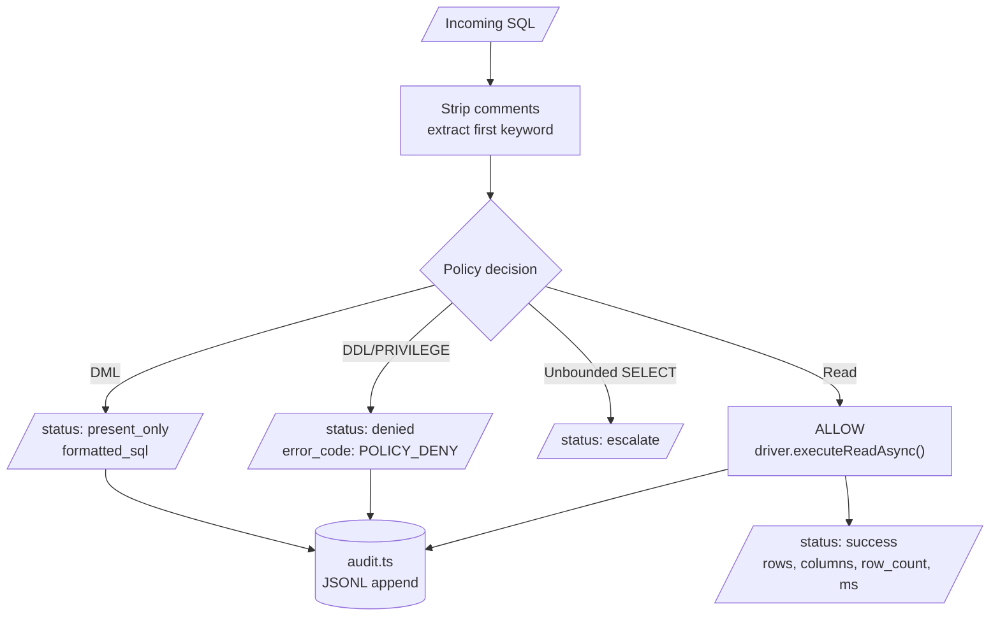
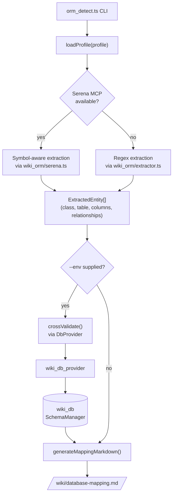
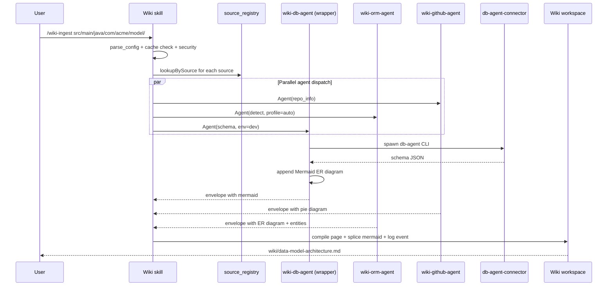

# Sources & Agents Architecture

How doc-wiki discovers, fetches, and compiles knowledge from external platforms, databases, and codebases into structured wiki pages — with a focus on **every external surface** the system touches and the read-only guarantees that protect each one.

**Scope of this document:** sources, agents, the orchestrating skill, source-to-agent dispatch, database & ORM integration, credential resolution, the ingest pipeline, and the cross-cutting infrastructure that ties them together. Code paths cited throughout are relative to the repository root.

---

## 1. Overview

Three abstractions carry the whole system:

- **Sources** — places where knowledge lives: a GitHub repo, a Confluence space, a PostgreSQL database, ORM entity classes in your own code, a Jira project, a Notion workspace, GCP/AWS infrastructure, or a local file/folder.
- **Agents** — workers that talk to one platform each and return a normalized JSON envelope. Agents live under `.claude/agents/` and are defined by an `AGENT.md` file with YAML frontmatter.
- **The wiki skill** (`.claude/skills/wiki/SKILL.md`) — the orchestrator. It reads `wiki.config.yaml`, dispatches enabled agents in parallel via Claude Code's `Agent()` tool, collects their JSON output, and compiles wiki pages with Mermaid diagrams.

There is **no standalone CLI**: every LLM call goes through Claude Code's session. TypeScript scripts (in `.claude/skills/wiki/scripts/` and `.claude/agents/lib/`) handle deterministic operations — hashing, parsing, graph traversal, lint, security checks — and are invoked with `node`.



**Read-only by default.** Every external integration in this system is read-only:
- Source agents call only `GET` HTTP verbs (or read-equivalent SDK methods like `list_*`, `describe_*`, `get_*`).
- The database agent passes every query through a policy gate that hard-blocks DDL/privilege ops and intercepts DML before execution.
- Tool whitelists in each AGENT.md frontmatter restrict what the agent can do (most agents only have `Bash, Read`; only maintenance and DB agents have `Write` for local file output).

---

## 2. Component Inventory

### 2.1 Slash commands (10) — `.claude/commands/`

Thin wrappers so each `/wiki-*` subcommand is autocompleted by Claude Code. Each routes into the `wiki` skill with `$ARGUMENTS` passed through.

| Command | Purpose |
|---|---|
| `/wiki-init` | Scaffold wiki directory + `wiki.config.yaml` |
| `/wiki-onboard` | Interactive 6-phase ecosystem detection |
| `/wiki-ingest` | Fetch + compile a source into wiki pages |
| `/wiki-query` | Summary-first search across the wiki |
| `/wiki-lint` | Health check (broken links, orphans, drift) |
| `/wiki-fix` | Targeted correction to a wiki page |
| `/wiki-promote` | Promote an archived query answer to a permanent page |
| `/wiki-refresh` | Re-fetch and update from original sources |
| `/wiki-path` | Shortest-path graph query between two concepts |
| `/wiki-stats` | Cost and token-efficiency metrics |

### 2.2 Agents (10) — `.claude/agents/`

| Agent | Type | Default Model | Schemes | URL Patterns | Entry script |
|---|---|---|---|---|---|
| `wiki-github-agent` | source | `haiku` | `gh://`, `github://` | `github.com`, `*.github.com` | `scripts/github_fetch.ts` |
| `wiki-jira-agent` | source | `haiku` | `jira://` | `*.atlassian.net/browse/` | `scripts/jira_fetch.ts` |
| `wiki-confluence-agent` | source | `haiku` | `confluence://` | `*.atlassian.net/wiki/`, `*.atlassian.net/**/spaces/` | `scripts/confluence_fetch.ts` |
| `wiki-notion-agent` | source | `haiku` | `notion://` | `notion.so`, `*.notion.site` | `scripts/notion_fetch.ts` |
| `wiki-gcp-agent` | source | `sonnet` | `gcp://` | `*.cloud.google.com`, `*.googleapis.com` | `scripts/gcp_query.ts` |
| `wiki-aws-agent` | source | `sonnet` | `aws://` | `*.amazonaws.com`, `*.aws.amazon.com` | `scripts/aws_query.ts` |
| `wiki-db-agent` | database | `haiku` | `db://` | — | `scripts/db_query.ts` (wrapper, see §5) |
| `wiki-orm-agent` | mapper | `sonnet` | — | — | `scripts/orm_detect.ts` |
| `wiki-claude-md-agent` | maintenance | `sonnet` | — | — | `scripts/claude_md_gen.ts` |
| `wiki-mermaid-agent` | maintenance | `inherit` | — | — | `scripts/mermaid_gen.ts` |

All agents share a single output envelope contract — see §2.5.

### 2.3 Shared libraries — `.claude/agents/lib/`

| Path | Role |
|---|---|
| `source_registry.ts` | Frontmatter-driven agent discovery + source-to-agent matching (§4) |
| `_agent_cli.ts` | `parseAgentArgs()` — shared CLI parser used by every source agent |
| `parse_config.ts` | Read/validate `wiki.config.yaml` (also used by skill scripts) |
| `security_check.ts` | URL scheme allow-list, path containment, label sanitization |
| `fetch_helper.ts` | HTTP wrapper with 50 MB body cap and 60 s timeout |
| `mermaid_format.ts` | Diagram formatters (graph, ER, sequence, …) |
| `credential_providers/` | Pluggable secret backends: `keychain`, `env_var`, `file`, `cloud_secrets` (§7) |
| `wiki_db/` | Database driver registry, connection pool, policy gate, audit (§5) |
| `wiki_orm/` | ORM extractor, profile loader, Serena MCP adapter, db_provider abstraction (§6) |

### 2.4 Skill scripts — `.claude/skills/wiki/scripts/`

The skill ships with **21 TypeScript files** (compiled to `.js` siblings). Eleven are user-invokable; ten are internal helpers used by the skill's own pipeline.

User-invokable: `init_wiki`, `parse_config`, `event_logger`, `graph_ops`, `lint_checks`, `quality_score`, `cache_manager`, `extract_binary`, `extract_multimodal`, `mermaid_lint`, `security_check`.

Internal helpers: `apply_config`, `banlist`, `checkpoint`, `daily_summary`, `hook_installer`, `how_to_go_deeper`, `mermaid_inject`, `summaries_rebuild`, plus underscore-prefixed utilities (`_cli_args`, `_frontmatter`, `_optional`, `_wiki_fs`).

> **Drift note:** the root `CLAUDE.md` claims 11 scripts; the actual count is 21. See §13.

### 2.5 Standard output envelope

Every agent returns this shape:

```json
{
  "status": "success",
  "action": "<echoed action name>",
  "data": { /* action-specific payload */ },
  "mermaid": {
    "type": "erDiagram",
    "title": "Database Schema",
    "code": "erDiagram\n  users {\n    bigint id PK\n  }"
  },
  "truncated": false
}
```

| Field | Required | Notes |
|---|---|---|
| `status` | yes | `success` / `error` / `denied` / `present_only` / `escalate` / `unchanged` / `empty` |
| `action` | yes | Echoes the requested action |
| `data` | yes | Per-action structured result |
| `mermaid` | no | Optional diagram (`type`, `title`, `code`) — skill splices into pages |
| `truncated` | yes | `true` if results were capped |
| `error_code`, `message` | on error | Machine + human strings |

The skill collects envelopes, extracts `mermaid` blocks, and splices them into the compiled page via `mermaid_inject.ts` using idempotent `<!-- wiki-mermaid: title start/end -->` markers — re-ingesting **replaces** stale diagrams rather than stacking duplicates.

---

## 3. External Integrations (the new emphasis)

For every external service the system can talk to: protocol, auth, scope, supported actions, and the explicit read-only contract.

### 3.1 GitHub — `wiki-github-agent`

| Field | Value |
|---|---|
| Protocol | HTTPS REST v3 (and GraphQL where useful) |
| Base URL | `https://api.github.com` |
| Auth | Bearer token; resolved via credential provider (e.g. `WIKI_GITHUB_TOKEN`) |
| HTTP verbs allowed | `GET` only |
| Actions | `repo_info`, `search_code`, `get_issues`, `get_pulls`, `get_file` |
| Caps | `max_results` per action (default 30, hard max 1000); file size cap 1 MB |
| Rate limits | Honors GitHub's `X-RateLimit-*` headers; surfaces `RATE_LIMITED` error code |

**Read-only contract:** the agent never calls `POST/PATCH/PUT/DELETE`. AGENT.md `tools: [Bash, Read]` — no `Write` tool, so even local mutation surface is closed.

### 3.2 Atlassian Jira — `wiki-jira-agent`

| Field | Value |
|---|---|
| Protocol | HTTPS REST v3 |
| Base URL | `https://<workspace>.atlassian.net/rest/api/3` |
| Auth | HTTP Basic = `email:api_token` (token via credential provider) |
| HTTP verbs allowed | `GET` only |
| Actions | `jql_search`, `get_issue`, `get_project` |
| Caps | `max_results` default 50, max 1000 |
| Rate limits | Standard Atlassian throttling; surfaces `RATE_LIMITED` |

**Read-only contract:** no issue creation, transitions, or comments. JQL is validated client-side before the API call.

### 3.3 Atlassian Confluence — `wiki-confluence-agent`

| Field | Value |
|---|---|
| Protocol | HTTPS REST API |
| Base URL | `https://<workspace>.atlassian.net/wiki/rest/api` |
| Auth | HTTP Basic = `email:api_token` (same credential as Jira when on same tenant) |
| HTTP verbs allowed | `GET` only |
| Actions | `cql_search`, `get_page`, `get_space` |
| Caps | `max_results` default 25, max 500 |
| Body conversion | Confluence `storage` HTML → Markdown done client-side |

**Read-only contract:** no page creation, edits, or comments. CQL is validated client-side.

### 3.4 Notion — `wiki-notion-agent`

| Field | Value |
|---|---|
| Protocol | HTTPS REST v1 |
| Base URL | `https://api.notion.com/v1` |
| API version header | `Notion-Version: 2022-06-28` (or later) |
| Auth | Bearer integration token (Internal Integration) |
| HTTP verbs allowed | `GET`, plus `POST` for `search` and `databases/<id>/query` (read-only by Notion contract) |
| Actions | `search`, `get_page`, `get_database`, `query_database` |
| Caps | `max_results` default 25, max 100 |
| Block conversion | Notion blocks → Markdown done client-side |

**Read-only contract:** the integration must be granted only "Read content" capabilities in Notion's settings; the agent never calls `pages.create` or `pages.update`.

### 3.5 Google Cloud Platform — `wiki-gcp-agent`

| Field | Value |
|---|---|
| Transport | `gcloud` CLI + Google client libraries (per service) |
| Services touched | Cloud Run, Cloud SQL Admin, Pub/Sub, Cloud Logging |
| Auth | Application Default Credentials (ADC), gcloud session, or `GOOGLE_APPLICATION_CREDENTIALS` |
| Actions | `list_services`, `describe_db`, `list_topics`, `query_logs` |
| Read-only API surface | `*.list`, `*.get`, `entries.list`, `instances.get`, `databases.get` |
| Log filter handling | Filters are sanitized client-side to prevent injection |

**Read-only contract:** the agent never invokes mutating endpoints (`*.create`, `*.delete`, `*.patch`). The AGENT.md "CRITICAL RULES" enforce this; reviewers should keep that whitelist in mind when adding actions.

### 3.6 Amazon Web Services — `wiki-aws-agent`

| Field | Value |
|---|---|
| Transport | `aws` CLI + SDK (AWS SDK for Python or JS, depending on action) |
| Services touched | Lambda, RDS, S3, CloudWatch |
| Auth | IAM role (EC2/Lambda), AWS profile (`~/.aws/config`), or env vars (`AWS_ACCESS_KEY_ID`, `AWS_SECRET_ACCESS_KEY`) |
| Actions | `list_functions`, `describe_db`, `list_buckets`, `get_metrics` |
| Read-only API surface | `Get*`, `List*`, `Describe*` only |
| Region | Required parameter for region-scoped APIs |

**Read-only contract:** the AGENT.md explicitly forbids `Put*`, `Create*`, `Delete*`, `Update*` calls. Suggested IAM policy: `ReadOnlyAccess` (or service-scoped read-only managed policies).

### 3.7 Databases — `wiki-db-agent` (see §5 for the deep-dive)

Six driver families, all read-only via the policy gate (`db://` scheme):

| Driver | Default port | Connector | Sync? |
|---|---|---|---|
| PostgreSQL | 5432 | `pg` | async (`BEGIN READ ONLY` txn + `statement_timeout`) |
| MySQL/MariaDB | 3306 | `mysql2` | async |
| SQLite | — (file) | `better-sqlite3` | sync (adapted via `adaptDriver`) |
| SQL Server | 1433 | `mssql` | async |
| MongoDB | 27017 | `mongodb` | async |
| DynamoDB | HTTPS | AWS SDK | async |

---

## 4. Source-to-Agent Dispatch

This is the mechanism that replaced hardcoded `if/switch` statements. It is **not in the previous version of this doc** and is now load-bearing.

### 4.1 Registry contract

`/Users/narayan/src/doc-wiki/.claude/agents/lib/source_registry.ts` exposes:

```typescript
initRegistry({ agentsDir, pluginsDir?, customAgents? });
lookupBySource(source: string): AgentManifest | null;
listAgents(filter?): AgentManifest[];
registeredAgentIds(): Set<string>;
```

Discovery happens in three stages, last-wins on name collision: **builtin** (filesystem scan of `.claude/agents/*/AGENT.md`) → **plugin** (optional `pluginsDir`) → **custom** (entries from `ecosystem.agents.custom` in `wiki.config.yaml`).

### 4.2 AGENT.md frontmatter contract

Every agent declares the registry fields as first-class frontmatter (no longer hidden in code):

```yaml
version: "1.0.0"
source_schemes: ["jira://"]
source_url_patterns:
  - hostname: "*.atlassian.net"
    path_prefix: "/browse/"
invocation_template:
  subagent_type: wiki-jira-agent
  default_model: haiku
  label: Jira
```

For agents that pre-date the registry fields, `BUILTIN_DEFAULTS` inside `source_registry.ts` provides a fallback map so nothing breaks during migration.

### 4.3 Lookup algorithm



Matching order:
1. **URL sources** (`https?://`): two passes — first patterns with `path_prefix`/`path_contains` (more specific, e.g. distinguishes Confluence from Jira on the same Atlassian host), then hostname-only.
2. **Scheme sources** (`jira://`, `db://`, …): exact match against `source_schemes`.
3. Returns `null` if no match.

Hostname matching supports a leading `*.` glob (e.g. `*.atlassian.net` matches `acme.atlassian.net` but also bare `atlassian.net`).

### 4.4 Custom agents — zero-code registration

Drop a block into `wiki.config.yaml` and the registry picks it up at next `initRegistry()`:

```yaml
ecosystem:
  agents:
    custom:
      - name: wiki-internalwiki-agent
        type: source
        model: haiku
        source_schemes: ["internalwiki://"]
        source_url_patterns:
          - hostname: "wiki.internal.acme.com"
        invocation_template:
          subagent_type: wiki-internalwiki-agent
          default_model: haiku
          label: InternalWiki
```

---

## 5. Database Integration Deep-Dive

The `wiki-db-agent` is now a **wrapper** that delegates to an external `db-agent-connector` plugin. This is a recent extraction — the database engine (drivers, policy gate, connection pool, audit trail) lives in a standalone repo and ships as an installable plugin so other tools can reuse it. Doc-wiki keeps only the wiki-specific bits.

### 5.1 Wrapper architecture



Source: `/Users/narayan/src/doc-wiki/.claude/agents/wiki-db-agent/scripts/db_query.ts`. The wrapper's only added value is appending a Mermaid ER diagram to schema responses (so the standalone plugin stays pure).

### 5.2 The policy gate (still binding)

The plugin's policy classifies each query and returns one of four decisions:

| Decision | Triggered by | Effect |
|---|---|---|
| **ALLOW** | `SELECT`, `EXPLAIN`, `SHOW`, `DESCRIBE`, `WITH` (with bounds) | Executes through the driver |
| **DENY** | `CREATE`, `DROP`, `ALTER`, `TRUNCATE`, `GRANT`, `REVOKE`, unknown verbs | Hard block; never executed |
| **ESCALATE** | Unbounded `SELECT` (no `WHERE` / `LIMIT` / `JOIN ... ON` / `GROUP BY` / `HAVING`) | Requires explicit human approval |
| **PRESENT_ONLY** | `INSERT`, `UPDATE`, `DELETE`, `REPLACE`, `MERGE`, `UPSERT` | SQL is **formatted and returned**, never executed |

Non-SQL drivers (MongoDB, DynamoDB) override `classifyOperation()` to map their own verbs (e.g. Mongo `find` → READ, `insertOne` → DML; DynamoDB `scan` → READ, `putItem` → DML). The policy gate is identical after classification.

### 5.3 Approval modes (per environment)

Set in `wiki.config.yaml` → `ecosystem.database.environments.<env>.approval_mode`:

| Mode | Behavior |
|---|---|
| `auto` | All `ALLOW` reads execute without prompting |
| `confirm_once` | First read prompts; subsequent reads in the same session inherit the grant |
| `confirm_each` | Every read prompts |
| `grant_required` | Reads only run if a time-limited grant is active (`grant_duration_hours`, default 8) |

Grants are in-process only (`performance.now()`), so they never bleed across CLI invocations.

### 5.4 Driver matrix

| Driver | npm package | Sync/async | How read-only is enforced |
|---|---|---|---|
| `postgresql` (alias `postgres`) | `pg` | async | `BEGIN READ ONLY` + server-side `statement_timeout` |
| `mysql` | `mysql2` | async | Read-only session + statement timeout |
| `sqlite` | `better-sqlite3` | sync (adapted) | SQLite read-only mode + `adaptDriver()` wraps result in `Promise.resolve()` |
| `sqlserver` (alias `mssql`) | `mssql` | async | Read-only transaction + query timeout |
| `mongodb` (alias `mongo`) | `mongodb` | async | Driver `classifyOperation` maps mutating verbs to PRESENT_ONLY/DENY |
| `dynamodb` (alias `dynamo`) | AWS SDK | async | Same — only `Scan`/`Query`/`GetItem`/`BatchGetItem` reach the wire |

**Async-only contract:** every driver implements `executeReadAsync(conn, sql, params, maxRows, timeoutMs): Promise<ExecuteReadResult>`. Sync-only drivers (SQLite) are adapted at the call site by `adaptDriver()` in the wrapper's pipeline. There is no longer a separate sync `execute` path — see CLAUDE.md "Architecture contracts".

### 5.5 Query lifecycle



Audit notes: every policy decision, query execution, and lifecycle event is appended JSONL to the path in `ecosystem.database.audit.path`. Credentials in SQL strings (`password='…'`, `token="…"`, `api_key=…`) are scrubbed **before** truncation so split credentials cannot leak. Audit failures are swallowed so logging never breaks query execution.

### 5.6 CLI usage

```bash
# Named environment from wiki.config.yaml
node .claude/agents/wiki-db-agent/scripts/db_query.js --env dev --sql "SELECT 1"
node .claude/agents/wiki-db-agent/scripts/db_query.js --env dev --action schema --filter "user%"

# Direct SQLite mode (tests / ad-hoc local)
node .claude/agents/wiki-db-agent/scripts/db_query.js --sqlite ./test.db --sql "SELECT name FROM users"
```

Schema results are augmented in-process with a Mermaid ER diagram before being written to stdout.

---

## 6. ORM Integration Deep-Dive

The `wiki-orm-agent` (mapper) detects entity-to-table mappings in your source code and produces `database-mapping.md` with a Mermaid ER diagram.

### 6.1 The 7 ORM profiles

YAML files under `.claude/agents/lib/wiki_orm/profiles/`:

| Profile | Language | Entity marker | Table mapping |
|---|---|---|---|
| `jpa.yaml` | Java | `@Entity` | `@Table(name="…")` |
| `sqlalchemy.yaml` | Python | `class X(...Base...)` | `__tablename__ = "…"` |
| `django.yaml` | Python | `class X(models.Model)` | `Meta: db_table = "…"` |
| `prisma.yaml` | TS schema | `model X {` | `@@map("…")` |
| `typeorm.yaml` | TypeScript | `@Entity()` | `@Entity("name")` |
| `entity_framework.yaml` | C# | `public class X` | `[Table("…")]` |
| `activerecord.yaml` | Ruby | `class X < ApplicationRecord` | `self.table_name = "…"` |

**Profile compilation invariant:** `loadProfile()` compiles every regex-valued field at load time. A bad pattern throws `ProfileValueError` with the file path and offending pattern — fail-fast over the alternative of silently producing nothing.

### 6.2 Two extraction paths



- **Regex path (default):** windowed three-pass scan over file contents. Fast, works offline, runs in CI. See `extractor.ts`.
- **Serena MCP path (preferred):** uses `mcp__plugin_serena_serena__search_for_pattern`, `find_symbol`, and `find_referencing_symbols`. More accurate because it understands enclosing classes and symbol references. Falls back automatically when the MCP server is not connected.

Both paths produce the same `ExtractedEntity[]` so the downstream pipeline is identical.

### 6.3 The new `db_provider` abstraction

This decouples the ORM extractor from `wiki_db` internals. Instead of importing `wiki_db` directly, `crossValidate()` accepts a `DbProvider`:

```typescript
// .claude/agents/lib/wiki_orm/db_provider.ts
export interface DbProvider {
  getSchema(envName: string, tableFilter?: string | null): Promise<DbTable[]>;
}
```

The concrete implementation lives in `.claude/agents/lib/wiki_orm/wiki_db_provider.ts` and bridges to `wiki_db`'s `getConnection` + `SchemaManager`. Tests can substitute an in-memory `DbProvider` without spinning up a database.

This matters because the database engine has been extracted to a separate plugin (§5). The provider abstraction lets the ORM cross-validation keep working whether the database backend is the local `wiki_db` library or an installed `db-agent-connector` plugin.

### 6.4 Cross-validation report

When `--env <name>` is set and `ecosystem.orm.cross_validate_against_db: true`:

- **Unmapped tables** — DB has the table, no entity claims it.
- **Orphan entities** — Entity exists, no DB table to back it.
- **Column mismatches** — Type/name differences between entity and column.

Connection failures **do not crash the CLI** — they surface as an `error` string inside the `cross_validation` report, and every entity is reported as orphan.

### 6.5 Output

`wiki/database-mapping.md` with: YAML frontmatter, entity-table mapping table, unmapped tables, dual-access tables, cross-validation report, and a Mermaid ER diagram (required output, not optional). Bidirectional relationships are deduplicated by unordered table pair — the "natural" direction wins (`one_to_many` over `many_to_one`; `many_to_many` always wins).

---

## 7. Credential Resolution

A new dedicated section because credentials touch every external integration and the previous doc gave them only a passing mention.

### 7.1 Provider chain

```mermaid
flowchart LR
    Caller["Code that needs a secret<br/>(e.g. wiki_db connect)"]
    Resolve["resolveSecret(name, options)"]
    Primary{primary provider<br/>(e.g. keychain)}
    F1{fallback[0]<br/>(e.g. env_var)}
    F2{fallback[1]<br/>(e.g. file)}
    Hit[(Secret value)]
    Miss[(null)]

    Caller --> Resolve --> Primary
    Primary -->|hit| Hit
    Primary -->|null/throw| F1
    F1 -->|hit| Hit
    F1 -->|null/throw| F2
    F2 -->|hit| Hit
    F2 -->|null| Miss
```

Source: `/Users/narayan/src/doc-wiki/.claude/agents/lib/credential_providers/index.ts`.

### 7.2 The 4 providers

| Provider | Sync? | Backed by | When to pick |
|---|---|---|---|
| `keychain` | yes | macOS `security` CLI | Workstations on macOS |
| `env_var` | yes | `process.env[<prefix><NAME>]` | CI, containers, Linux dev boxes |
| `file` | yes | Local JSON file (path from config) | Air-gapped or shared workstations |
| `cloud_secrets` | async only | GCP Secret Manager + AWS Secrets Manager | Production / managed envs |

The `getSecretSync` method is optional — providers that hit the network omit it.

### 7.3 Where credentials surface in config

Three layered locations (more-specific overrides less-specific):

```yaml
credentials:                            # top-level — global default
  provider: keychain
  fallback: [env_var]
  prefix: "WIKI_"

ecosystem:
  credentials:                          # ecosystem-scoped override
    provider: env_var
  database:
    environments:
      dev:
        user_secret: "WIKI_DB_DEV_USER"           # logical name
        password_secret: "WIKI_DB_DEV_PASSWORD"   # resolved at connect time
```

Database environments use `user_secret` / `password_secret` keys whose values are **logical names**, not the secret itself. The resolution happens at connection time so secrets never sit in process memory longer than needed.

### 7.4 What is never logged

- The audit trail (`wiki_db/audit.ts`) scrubs `password='…'`, `token="…"`, `api_key=…` from SQL strings **before** truncation, so a credential split across a truncation boundary cannot leak.
- The event log (`event_logger.ts`) does not include source URLs verbatim if they contain auth in the userinfo segment.
- Source agents pass tokens via HTTP headers, never in URLs.

---

## 8. The Ingest Pipeline

The 13-step pipeline that turns source material into wiki pages. Step 7 is now **registry-driven** rather than hardcoded.

```
1.  Parse wiki.config.yaml                       parse_config.ts
2.  Check content-hash cache                     cache_manager.ts
3.  Extract binary / multimodal content          extract_binary.ts / extract_multimodal.ts
4.  Security check (URL, path containment)       security_check.ts
5.  Read source fully                            (LLM)
6.  Surface 3-5 takeaways + entity list          (LLM)
7.  Dispatch enabled agents IN PARALLEL          source_registry.ts → Agent() tool
        ↳ each agent fetches from its platform
        ↳ returns standard envelope with mermaid
8.  Compile into wiki page(s)                    (LLM, refs/compilation.md)
9.  Splice Mermaid blocks (idempotent markers)   mermaid_inject.ts
10. Generate "How to Go Deeper" bullets          how_to_go_deeper.ts
11. Rebuild summaries.md index                   summaries_rebuild.ts
12. Log event with per-agent cost                event_logger.ts
13. Run post-op hooks (crosslink, tag-harmonize) (LLM + hook_installer.ts)
```

**Two pipeline features worth calling out** (also missing from the previous doc):

- **`checkpoint.ts`** — folder ingests are resumable. The pipeline writes per-source checkpoints; if the run is interrupted, the next invocation resumes where it left off rather than restarting.
- **`banlist.ts`** — anti-repetition memory. Failed-direction summaries are persisted into `summaries.md` so future ingests don't re-explore abandoned research paths.

Step 10's "How to Go Deeper" classifies each source in the page's `sources:` frontmatter and emits the exact agent invocation for further exploration:
- Jira URL → `Agent({subagent_type: "wiki-jira-agent", prompt: '{"action":"get_issue","params":{"issue_key":"PROJ-123"}}'})`
- GitHub URL → `Agent({subagent_type: "wiki-github-agent", prompt: '{"action":"get_file","params":{...}}'})`
- `db://dev/users` → `Agent({subagent_type: "wiki-db-agent", prompt: '{"action":"schema","env":"dev","filter":"users"}'})`

---

## 9. The Onboarding Pipeline (`/wiki-onboard`)

Six-phase interactive Q&A that bridges "I have a codebase" and "the wiki knows what to fetch".

| Phase | What it does | Underlying machinery |
|---|---|---|
| 1 — Language/framework | Scan build files (`pom.xml`, `package.json`, …) | Heuristic file-marker scan |
| 2 — ORM detection | Match shipped profiles against codebase | `wiki-orm-agent` regex or Serena MCP |
| 3 — Database detection | Read Docker Compose, `.env`, ORM config for connection info | `wiki-db-agent` (now via the wrapper plugin) |
| 4 — External services Q&A | Ask about Jira/Confluence/GCP/AWS/Notion/GitHub | Toggles `ecosystem.agents.source.<name>` |
| 5 — Autonomy mode | Pick `conservative` / `balanced` / `autonomous` / `auto` | Saved to `autonomy.mode` |
| 6 — Hooks + scaffold | Install Claude Code PreToolUse hooks; generate `wiki.config.yaml`; run `/wiki-init` if needed | `hook_installer.ts`, `init_wiki.ts` |

Output: a fully populated `wiki.config.yaml` with detected language, framework, ORM profile, database environments, enabled source agents, autonomy mode, and credential provider.

---

## 10. Cross-Cutting Infrastructure

| Concern | File | Notes |
|---|---|---|
| HTTP fetch caps | `.claude/agents/lib/fetch_helper.ts` | 50 MB body, 60 s timeout, abort before reading body if `Content-Length` exceeds cap |
| URL & path safety | `.claude/agents/lib/security_check.ts` (also `.claude/skills/wiki/scripts/security_check.ts`) | URL scheme allow-list (`http`, `https`); resolves symlinks for path containment; sanitizes labels (strip control chars, HTML-escape, max 256 chars) |
| Event log | `.claude/skills/wiki/scripts/event_logger.ts` | Appends to `<wiki-root>/log/events.jsonl`. Per-agent cost metrics (`AgentCallEvent`: name, model, tokens_in/out, cost_usd, elapsed_ms, status) |
| Audit log (DB) | `.claude/agents/lib/wiki_db/audit.ts` (used by the plugin) | Separate JSONL at `ecosystem.database.audit.path`. Non-failing; credentials scrubbed |
| Content-hash cache | `.claude/skills/wiki/scripts/cache_manager.ts` | Skip re-ingesting a source whose content hash hasn't changed |
| Quality scoring | `.claude/skills/wiki/scripts/quality_score.ts` | Per-page and aggregate scoring (0.0–1.0) used by `/wiki-lint` |
| Lint | `.claude/skills/wiki/scripts/lint_checks.ts` + `mermaid_lint.ts` | Frontmatter, link, and Mermaid validation |

---

## 11. Multi-Tool Wrappers

The wiki skill is reachable from four AI coding tools through wrapper files. All four route to the same skill — the skill itself is the single source of truth.

| File | Tool | Notes |
|---|---|---|
| `AGENTS.md` | Codex / OpenAI agents | Lists all `/wiki-*` commands and the underlying `node` invocations |
| `GEMINI.md` | Gemini / Google AI | Same routing as `AGENTS.md` |
| `.cursor/rules/wiki.mdc` | Cursor IDE | Cursor rule file |
| `.aider/conventions.md` | Aider | Aider conventions file |

If you change the skill's commands, update these four wrappers (or accept that they'll drift). Long-term: a single generator could keep them in sync.

---

## 12. Configuration Reference

The current `wiki.config.yaml` shape (top-level keys only — full schema lives in `parse_config.ts`):

```yaml
wiki:
  name: <project>
  domain: <human-readable domain>
  max_depth: 3

ecosystem:
  language: java | python | typescript | ruby | csharp | go | rust
  build_tool: maven | gradle | npm | yarn | pipenv | cargo | dotnet
  framework: <e.g. spring-boot>
  framework_version: "X.Y.Z"

  agents:
    source: { <agent-id>: enabled|disabled }
    custom: [ {...custom AgentManifest fragments...} ]
    model_overrides: {}

  credentials:
    provider: keychain | env_var | file | cloud_secrets
    config: { ... }

  database:
    enabled: true
    driver: postgresql | mysql | sqlite | sqlserver | mongodb | dynamodb
    environments:
      <env>:
        host: localhost
        port: 5432
        database: mydb
        user_secret: "WIKI_DB_DEV_USER"
        password_secret: "WIKI_DB_DEV_PASSWORD"
        approval_mode: auto | confirm_once | confirm_each | grant_required
        grant_duration_hours: 8
    policy:
      block_ddl: true
      block_privilege: true
      dml_mode: present_only
      escalate_unbounded_reads: true
    audit:
      enabled: true
      path: "~/.wiki/db_audit.jsonl"

  orm:
    enabled: true
    profiles: [jpa | sqlalchemy | django | prisma | typeorm | entity_framework | activerecord]
    custom_profiles: []
    cross_validate_against_db: true

  mermaid:
    auto_generate: true
    types: [erDiagram, sequenceDiagram, graph, ...]
    lint_syntax: true

autonomy:
  mode: conservative | balanced | autonomous | auto
  overrides: { <check-type>: auto_fix | human_review | suggest }

credentials:                # top-level (global default)
  provider: keychain
  fallback: [env_var]
  prefix: "WIKI_"

security:
  url_schemes: ["http", "https"]
  fetch_size_cap_mb: 50
  fetch_timeout_s: 60
  path_containment_check: true
  label_sanitization:
    strip_control_chars: true
    max_length: 256
    html_escape: true
```

Key changes vs. the previous doc:

- `ecosystem.agents.custom` — custom source agents register here without code changes.
- `ecosystem.credentials` and top-level `credentials` — the pluggable provider chain.
- `ecosystem.mermaid` — diagram auto-generation policy.
- Database `driver` is the default; environments can opt into different drivers.

---

## 13. Appendix: Known Drift

These are not introduced by this document but are worth flagging for follow-up:

- **`CLAUDE.md` script count.** The root `CLAUDE.md` says "TypeScript scripts (11)"; the actual count under `.claude/skills/wiki/scripts/` is 21 (11 user-invokable + 10 internal helpers). The list of 11 in `CLAUDE.md` is also missing `extract_multimodal.ts`. Worth a one-line correction.
- **`db-agent-connector` extraction.** The previous architecture doc described `wiki_db` as living entirely inside doc-wiki. It is now an external plugin, with this repo holding only the wrapper (`scripts/db_query.ts`) plus the `lib/wiki_db/` code that the wrapper still uses for tests and the local-dev fallback path. The boundary will continue to shift — see project memory note "DB agent extraction".
- **Skill-versus-wrapper duplication.** `security_check.ts` and `parse_config.ts` exist in both `.claude/agents/lib/` and `.claude/skills/wiki/scripts/`. They are kept in lockstep manually; a follow-up could collapse them.

---

## How it all connects (end-to-end)



The system is designed so that each piece is independently useful but compounds when combined: the database plugin can run standalone for schema docs; the ORM agent can run standalone for code-to-table mapping; with both enabled and `cross_validate_against_db: true` you get the full picture — which entities map to which tables, which tables have no entity, and where code and database disagree.
