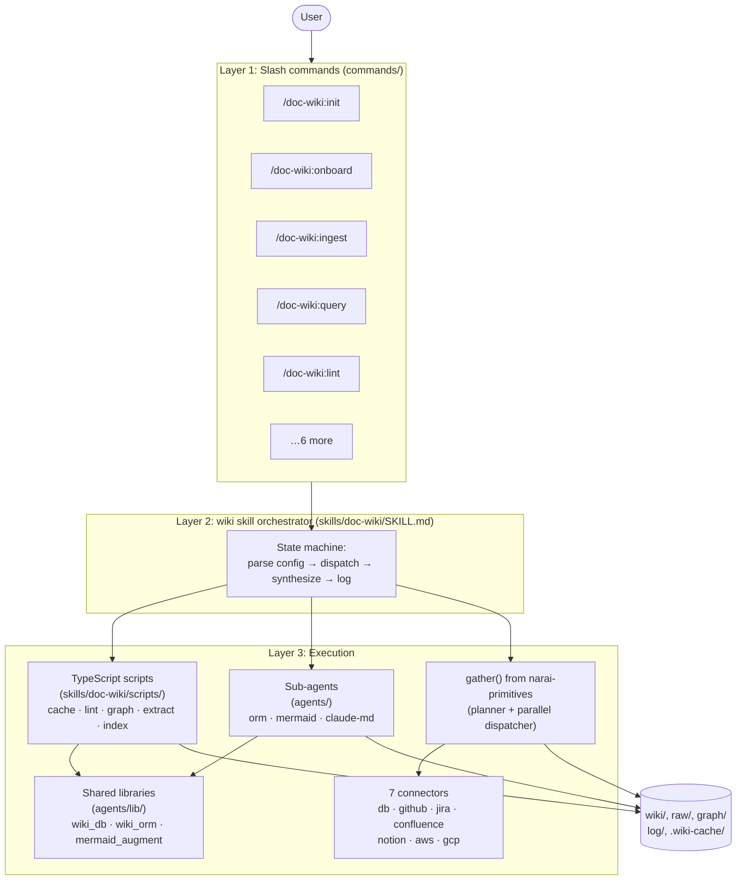
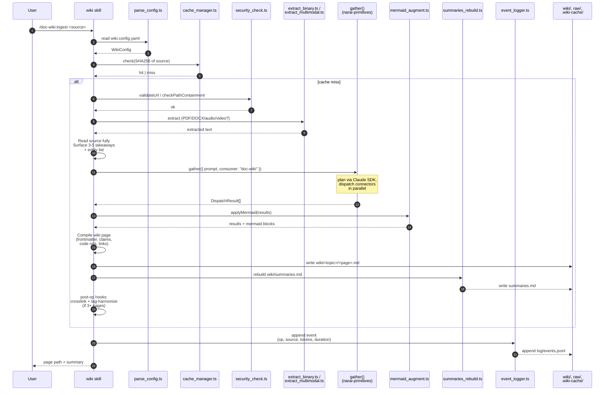
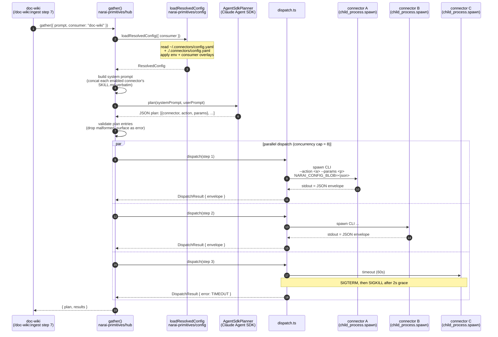

# Architecture

doc-wiki is a documentation wiki generator and maintainer that runs entirely as Claude Code skills, agents, and TypeScript helper scripts. There is no daemon, no service, no external API to call from your shell — every operation is initiated by a `/doc-wiki:*` slash command, mediated by the orchestrator skill, and carried out by a mix of deterministic TypeScript scripts, three sub-agents, and a single planner-dispatcher (`gather()` from [`narai-primitives`](connectors.md)) for external sources.

This document explains how the layers fit together, what each script and agent is for, and which architecture invariants are load-bearing.

## Table of contents

- [Three-layer model](#three-layer-model)
- [Layer 1 — Slash commands](#layer-1--slash-commands)
- [Layer 2 — The wiki skill orchestrator](#layer-2--the-wiki-skill-orchestrator)
- [Layer 3 — Execution](#layer-3--execution)
  - [3a. TypeScript scripts](#3a-typescript-scripts)
  - [3b. Agents](#3b-agents)
  - [3c. Shared libraries](#3c-shared-libraries)
  - [3d. `gather()` from `narai-primitives`](#3d-gather-from-narai-primitives)
- [Diagram 2 — `/doc-wiki:ingest` pipeline](#diagram-2-wiki-ingest-pipeline)
- [Diagram 3 — `gather()` internals](#diagram-3-gather-internals)
- [Reference docs](#reference-docs)
- [Multi-platform wrappers](#multi-platform-wrappers)
- [Architecture contracts](#architecture-contracts)
- [Security baseline](#security-baseline)
- [Testing posture](#testing-posture)
- [Build posture](#build-posture)

## Three-layer model

User input flows top-down through three layers. Each layer has a narrow responsibility:

- **Layer 1 — Slash commands** (10 thin wrapper files) make commands discoverable in each AI tool's autocomplete.
- **Layer 2 — Wiki skill orchestrator** (one `SKILL.md`) is a state machine that reads config, dispatches scripts and agents, and synthesizes pages.
- **Layer 3 — Execution** is a mix of deterministic TypeScript scripts, three derivative agents, shared libraries, and one planner (`gather()`) for external sources.

### Diagram 1: Three-layer model



Reading the diagram: the user invokes a slash command, which calls into the skill, which reads the wiki config and dispatches the appropriate combination of scripts, agents, and (for external context) `gather()`. All output lands in the wiki root (`wiki/`, `raw/`, `graph/`, `log/`, `.wiki-cache/`) — there is no remote storage.

## Layer 1 — Slash commands

Ten `commands/doc-wiki:*.md` files. Each is a YAML-frontmatter wrapper that registers the command with its host AI tool and forwards arguments into the orchestrator skill.

| Command | What it does |
|---|---|
| [`/doc-wiki:init`](../commands/doc-doc-wiki-init.md) | Bootstrap the wiki directory scaffold and default config |
| [`/doc-wiki:onboard`](../commands/doc-doc-wiki-onboard.md) | Interactive setup: detect language, ORM, DB, configure connectors |
| [`/doc-wiki:ingest`](../commands/doc-doc-wiki-ingest.md) | Fetch, extract, and compile a source into wiki pages |
| [`/doc-wiki:query`](../commands/doc-doc-wiki-query.md) | Summary-first search and synthesis across the wiki |
| [`/doc-wiki:lint`](../commands/doc-doc-wiki-lint.md) | Structural health check and auto-heal |
| [`/doc-wiki:fix`](../commands/doc-doc-wiki-fix.md) | Targeted correction to a single wiki page |
| [`/doc-wiki:promote`](../commands/doc-doc-wiki-promote.md) | Convert an archived `/doc-wiki:query` answer into a permanent page |
| [`/doc-wiki:refresh`](../commands/doc-doc-wiki-refresh.md) | Re-fetch and update previously ingested sources |
| [`/doc-wiki:path`](../commands/doc-doc-wiki-path.md) | Shortest-path query between two concepts via typed edges |
| [`/doc-wiki:stats`](../commands/doc-doc-wiki-stats.md) | Token efficiency and cost metrics from the event log |

Each wrapper looks roughly like:

```yaml
---
description: Bootstrap a wiki — scaffold directories and default config
argument-hint: '[--path <wiki-root>] [--domain <domain>] [--name <wiki-name>]'
allowed-tools: Skill(doc-wiki)
---

Invoke the `doc-wiki` skill to run the `/doc-wiki:init` workflow ...
Call `Skill(doc-wiki, "init $ARGUMENTS")`.
```

The wrappers exist purely so each command shows up in slash-command autocomplete. They do no work themselves.

For per-command argument and example reference, see [`commands.md`](commands.md).

## Layer 2 — The wiki skill orchestrator

[`skills/doc-wiki/SKILL.md`](../skills/doc-wiki/SKILL.md) is a 340+ line state machine. It is loaded into the Claude Code session when any `/doc-wiki:*` command fires, and it routes the command to the correct combination of scripts, agents, and `gather()` calls.

The orchestrator does not contain code — it's instructions for the LLM. Each subcommand section describes:

1. The phases the operation runs through.
2. Which TypeScript script to invoke (with exact CLI args).
3. Which sub-agent to dispatch (when needed).
4. How to interpret results and synthesize a wiki page.
5. What to log to `log/events.jsonl`.

Cross-cutting concerns are documented once and reused across commands:

- **Config I/O** — every command starts by calling `parse_config.ts` to read `wiki.config.yaml`.
- **Caching** — content-hash dedup via `cache_manager.ts` happens before any expensive operation.
- **Event logging** — every operation appends a structured event to `log/events.jsonl` via `event_logger.ts`.
- **Post-op hooks** — after any write op (ingest, fix, promote, refresh), the orchestrator runs **crosslink** + **tag-harmonize** passes, but only if the wiki has 3+ pages. Skip with `--no-crosslink` or `--no-tag-harmonize`.
- **Autonomy mode** — every change respects the configured autonomy level (`conservative` / `balanced` / `autonomous` / `auto`). See [`skills/doc-wiki/references/autonomy.md`](../skills/doc-wiki/references/autonomy.md).

## Layer 3 — Execution

Three independent execution surfaces. The orchestrator uses each for what it's good at.

### 3a. TypeScript scripts

Roughly 21 deterministic operations live at [`skills/doc-wiki/scripts/`](../skills/doc-wiki/scripts/). They compile to sibling `.js` files via `npm run build` and are invoked as `node <script>.js <args>`.

Grouped by purpose:

| Group | Scripts | Purpose |
|---|---|---|
| **Lifecycle** | `init_wiki.ts`, `parse_config.ts`, `apply_config.ts` | Scaffold, read, write `wiki.config.yaml` |
| **Caching** | `cache_manager.ts`, `checkpoint.ts` | SHA256 content-hash dedup; resume support for batch ingests |
| **Event logging** | `event_logger.ts`, `daily_summary.ts` | Append structured JSON to `log/events.jsonl`; aggregate stats |
| **Graph operations** | `graph_ops.ts` | Path queries (shortest, via, all-paths), god-node detection, cluster identification, orphan detection |
| **Quality + lint** | `lint_checks.ts`, `quality_score.ts`, `mermaid_lint.ts`, `summaries_rebuild.ts`, `banlist.ts` | Structural lint, page scoring, Mermaid syntax check, summaries index, anti-repetition memory |
| **Extraction** | `extract_binary.ts`, `extract_multimodal.ts` | PDF / DOCX / PPTX text extraction; audio / video / image transcription |
| **Security** | `security_check.ts` | URL validation, path containment, label sanitization |
| **Indexing** | `mermaid_inject.ts`, `how_to_go_deeper.ts` | Idempotent diagram splicing; "How to Go Deeper" link generation |
| **Hooks** | `hook_installer.ts` | Install PreToolUse hooks into `.claude/settings.json` (used by `/doc-wiki:onboard` phase 6) |
| **Helpers** | `_cli_args.ts`, `_frontmatter.ts`, `_optional.ts`, `_wiki_fs.ts` | Shared argument parsing, YAML frontmatter, optional-dep loader, filesystem utilities |

Every script has matching `*.test.ts` cases under `tests/`. Tests double as the most reliable usage examples — when in doubt about what a script accepts, read its tests.

### 3b. Agents

Three sub-agents live under [`agents/`](../agents/). Each has its own `AGENT.md` specification.

#### `wiki-orm-agent`

- **Path:** [`agents/wiki-orm-agent/`](../agents/wiki-orm-agent/)
- **Purpose:** Detect ORM patterns in a codebase and map entities to database tables.
- **Tools:** Bash, Read, Glob, Grep (Serena MCP when available).
- **Output:** A `database-mapping.md` page with a Mermaid ER diagram.
- **Profiles supported (7):** JPA / Hibernate, SQLAlchemy, Django ORM, Prisma, TypeORM, Entity Framework, ActiveRecord.
- **Cross-validation:** When called with a database environment name, the agent cross-validates ORM entities against the live DB schema (via the `wiki_db` library + the policy gate in `narai-primitives`'s `db` connector).

#### `wiki-mermaid-agent`

- **Path:** [`agents/wiki-mermaid-agent/`](../agents/wiki-mermaid-agent/)
- **Purpose:** Convert structured JSON (from connector envelopes or other sources) into fenced Mermaid blocks and inject them into wiki pages.
- **Tools:** Bash, Read, Write.
- **Constraint:** Purely deterministic — no LLM calls. All operations are string formatting and file I/O.
- **Diagram types:** `erDiagram`, `sequenceDiagram`, `flowchart`, `graph`, `classDiagram`, `stateDiagram`, `gantt`, `pie`, `gitgraph`.

#### `wiki-claude-md-agent`

- **Path:** [`agents/wiki-claude-md-agent/`](../agents/wiki-claude-md-agent/)
- **Purpose:** Generate and maintain `CLAUDE.md` files (root + per-submodule), preserving user-written content outside `<!-- wiki-managed: start/end -->` markers.
- **Tools:** Bash, Read, Write.
- **Operations:** `generate` (full creation) and `update` (managed-section refresh only).
- **Submodule handling:** Auto-discovers directories with their own `CLAUDE.md`, links them back to root.

### 3c. Shared libraries

Code that's shared between agents and scripts lives at [`agents/lib/`](../agents/lib/).

Two library directories:

| Library | Path | Purpose |
|---|---|---|
| `wiki_db` | `agents/lib/wiki_db/` | Connection pooling, async driver abstraction (SQLite, Postgres, MySQL, MSSQL, MongoDB, DynamoDB), policy-gated read-only schema introspection. Used by `wiki-orm-agent` for cross-validation. The connector-side policy gate lives in `narai-primitives`'s `db` connector — `wiki_db` is the wiki-side adapter. |
| `wiki_orm` | `agents/lib/wiki_orm/` | ORM mapper with 7 profiles loaded from YAML at runtime. Profile patterns are validated at load time (bad regex throws `ProfileValueError`). |

Four standalone modules at the same path:

| Module | Purpose |
|---|---|
| `parse_config.ts` | Read/validate `wiki.config.yaml` (used by skill + agents) |
| `source_registry.ts` | Source-to-connector matching (URL/scheme → connector ID). Static `BUILTIN_PATTERNS` list + custom patterns from `wiki.config.yaml`. **Never dispatches a connector** — only classifies sources for `how_to_go_deeper.ts`. |
| `mermaid_format.ts` | Mermaid diagram formatting utilities |
| `mermaid_augment.ts` | Single decoration site: applies wiki-specific `mermaid: { type, title, code }` blocks on top of raw `DispatchResult` envelopes from `gather()`. Called once per `/doc-wiki:ingest`. |

### 3d. `gather()` from `narai-primitives`

External-source fetching does not live in doc-wiki at all. It is delegated to `gather()` from [`narai-primitives`](https://github.com/narailabs/narai-primitives) — a planner + parallel-dispatcher that takes a natural-language prompt and returns context from any subset of seven enabled connectors (`db`, `github`, `jira`, `confluence`, `notion`, `aws`, `gcp`).

doc-wiki calls `gather()` exactly once per `/doc-wiki:ingest`, in step 7 of the pipeline. The hub plans which connectors to invoke, spawns each as a child process, and returns a `DispatchResult[]` where each entry carries either an `envelope` (success) or a structured `error` (failure). The wiki then runs `applyMermaid()` on the results to add wiki-specific Mermaid blocks before compiling the final page.

For the full `gather()` API, the `DispatchResult` envelope shape, and the seven connectors, see [`connectors.md`](connectors.md).

## Diagram 2: `/doc-wiki:ingest` pipeline



The numbered steps map to the orchestrator's instructions in [`SKILL.md`](../skills/doc-wiki/SKILL.md) (search for `### /doc-wiki:ingest`). Steps 1–6 are deterministic. Step 7 is the only place external services are touched. Steps 8–13 are deterministic.

A few subtle behaviors worth knowing:

- **Cache key includes config version.** Bumping `cache_manager.ts`'s version constant invalidates the entire cache — used when extraction logic changes.
- **Mermaid injection is idempotent.** `mermaid_inject.ts` wraps each block in `<!-- wiki-mermaid: <title> start/end -->`; re-ingest replaces in place.
- **Errors from `gather()` are non-fatal.** Each connector failure surfaces as a `DispatchResult.error`; the wiki page still compiles with whatever envelopes succeeded.
- **`applyMermaid` is the single decoration site.** All 7 connectors flow through it. If you need wiki-side Mermaid behavior for a new connector, add it to `mermaid_augment.ts` — never to a connector wrapper.

## Diagram 3: `gather()` internals

How the planner-dispatcher works inside `narai-primitives` itself:



Three things worth highlighting:

1. **The planner is an LLM call.** `AgentSdkPlanner` (the default) imports `@anthropic-ai/claude-agent-sdk` and asks Claude to choose connectors and actions based on the prompt. Plan steps are validated against each connector's declared actions; malformed steps are dropped (and surfaced as `DispatchResult.error`).
2. **Dispatch is subprocess-based, not in-process.** Each connector runs in its own Node child process so a misbehaving connector can't corrupt the parent. Configuration is passed via the `NARAI_CONFIG_BLOB` env var; credentials are loaded inside the child process by `@narai/credential-providers`. doc-wiki itself never sees a cleartext token.
3. **Errors are isolated per step.** A timeout, an unauthorized response, or a missing CLI in one connector does not fail the gather — just that step. The caller sees `results[i].error.code` (e.g., `TIMEOUT`, `DISPATCH_FAILED`, `CLI_NOT_FOUND`, `UNAUTHORIZED`) and decides how to handle it.

For the full `gather()` API, plan validation rules, and per-connector envelopes, see [`connectors.md`](connectors.md).

## Reference docs

Five operator manuals live at [`skills/doc-wiki/references/`](../skills/doc-wiki/references/). The orchestrator skill reads these on demand — they are not loaded upfront.

| Document | What it covers |
|---|---|
| [`autonomy.md`](../skills/doc-wiki/references/autonomy.md) | Autonomy levels (conservative / balanced / autonomous / auto), per-category overrides, dispute audit inbox |
| [`code-locality.md`](../skills/doc-wiki/references/code-locality.md) | When to reference code vs copy it; content-hash drift detection |
| [`compilation.md`](../skills/doc-wiki/references/compilation.md) | Page-type taxonomy (concept / entity / summary / index / lecture / claim / synthesis), required frontmatter, claims metadata, "How to Go Deeper" generation |
| [`operations.md`](../skills/doc-wiki/references/operations.md) | Detailed specs per operation: codebase markers, ORM patterns, DB detection, Q&A flow, scaffold template, onboarding phases |
| [`quality.md`](../skills/doc-wiki/references/quality.md) | Quality scoring formula (0.0–1.0), tag philosophy (content-only), Mermaid lint rules |

These are the source of truth for the orchestrator's behavior. The public docs in `docs/` paraphrase them where helpful.

## Multi-platform wrappers

The skill is exposed in five AI tools via wrapper files:

| File | Tool |
|---|---|
| [`AGENTS.md`](../AGENTS.md) | Codex / OpenAI agents |
| [`GEMINI.md`](../GEMINI.md) | Gemini / Google AI |
| [`.cursor/rules/wiki.mdc`](../.cursor/rules/wiki.mdc) | Cursor IDE |
| [`.aider/conventions.md`](../.aider/conventions.md) | Aider |
| `skills/doc-wiki/SKILL.md` | Claude Code (the canonical, full-detail manual) |

All five point back to the same scripts under `skills/doc-wiki/scripts/` and the same agents under `agents/`. The wrappers exist because each tool has its own slash-command discovery path and rule format; the skill itself is one orchestrator.

## Architecture contracts

These are load-bearing invariants. Implementers must respect them; reviewers should reject changes that violate them.

1. **Database drivers implement `executeReadAsync(conn, sql, params, maxRows, timeoutMs): Promise<ExecuteReadResult>`.** There is no sync `execute` path. Sync drivers (e.g., SQLite's `executeRead`) are adapted at the call site via `adaptDriver` (used by `wiki-orm-agent` and the `wiki_db` library tests).

2. **`getConnection(envName)` is async.** Callers must `await` it. `release` and `shutdown` use identity-based lookup on the awaited handle.

3. **Single source-fetch path through `gather()`.** `/doc-wiki:ingest` step 7 calls `gather()` from `narai-primitives`; doc-wiki does not maintain per-service subagents or wrappers. The hub owns CLI resolution, parallel dispatch, and per-step error isolation; `mermaid_augment.ts` owns wiki-specific decoration.

4. **Credential resolution uses the published package.** Import `resolveSecret`, `registerProvider`, and provider classes from `@narai/credential-providers` (not from a local path). Connectors load their own credentials inside the connector process — doc-wiki does not pass credentials into `gather()`.

5. **ORM profile patterns are validated at load time.** `loadProfile()` compiles every regex-valued pattern; a bad pattern throws `ProfileValueError` with the file path and offending pattern.

6. **Source-to-connector matching is data-driven.** `lookupBySource()` in `agents/lib/source_registry.ts` reads a static `BUILTIN_PATTERNS` list (one entry per connector bundled in `narai-primitives`). Custom patterns load via `ecosystem.agents.custom` in `wiki.config.yaml` — no code changes needed to add a new connector mapping. `lookupBySource` never dispatches a connector; it only classifies sources for `how_to_go_deeper.ts`.

7. **No Python in this repo.** All scripts are TypeScript. The only `.py` files are ORM-extractor test fixtures under `agents/lib/wiki_orm/tests/fixtures/{sqlalchemy,django}/`, read as text by the TypeScript tests. Verify with: `find . -name '*.py' -not -path './node_modules/*' -not -path './wiki-workspace/*' -not -path './.worktrees/*/node_modules/*'`.

8. **Idempotent Mermaid injection.** `mermaid_inject.ts` wraps blocks in `<!-- wiki-mermaid: <title> start/end -->` markers. Re-ingest replaces stale diagrams in place; never duplicates.

9. **Post-op hooks run automatically.** After write operations (ingest, fix, promote, refresh), crosslink and tag-harmonize passes run if the wiki has 3+ pages. Skip with `--no-crosslink` or `--no-tag-harmonize`.

10. **Autonomy mode controls writes.** Every change respects the configured autonomy level. Per-category overrides allow finer control (e.g., `auto` for crosslinks but `balanced` for new pages).

These contracts are mirrored verbatim in `CLAUDE.md` for Claude Code's project-memory layer; both must stay in sync if either is updated.

## Security baseline

The connector toolkit (in `narai-primitives/toolkit`) provides:

- **`validateUrl(url)`** — only `http://` and `https://` schemes are accepted.
- **`checkPathContainment(path, root)`** — symlink-resolved containment check (TOCTOU note: not atomic; relies on running on a private filesystem like a developer workstation, CI runner, or sandboxed container).
- **`fetchWithCaps(url, init?, caps?)`** — HTTP fetch with size cap (default 50 MB) and timeout (default 60 s), enforced via streaming + `AbortController`.
- **`sanitizeLabel(label, maxLen?)`** — strip control chars (`U+0000–001F`, `U+007F–009F`), HTML-escape, cap length.

Doc-wiki itself adds [`security_check.ts`](../skills/doc-wiki/scripts/security_check.ts) for URL validation prior to ingest. The full security posture is documented in [`compilation.md`](../skills/doc-wiki/references/compilation.md) and [`operations.md`](../skills/doc-wiki/references/operations.md).

The `db` connector adds a guard-rail policy on top of all this — see [`connectors.md`](connectors.md#db-connector) for the ALLOW / DENY / ESCALATE / PRESENT_ONLY decisions.

## Testing posture

| Suite | Location | Approximate count |
|---|---|---|
| Wiki scripts | `skills/doc-wiki/scripts/tests/` | ~150 |
| `wiki_db` library | `agents/lib/wiki_db/tests/` | ~200 |
| ORM mapper | `agents/lib/wiki_orm/tests/` | ~100 |
| `wiki-claude-md-agent` | `agents/wiki-claude-md-agent/scripts/tests/` | ~30 |
| `wiki-mermaid-agent` | `agents/wiki-mermaid-agent/scripts/tests/` | ~20 |
| **Full suite** | `.claude/**/*.test.ts` | **886 passed + 5 skipped** |

The 5 skipped tests are live-database integration tests, gated behind `TEST_LIVE_*` environment variables. They are intentionally not part of CI.

```sh
npm test                                            # full suite
npm run test:coverage                               # with v8 coverage
npm run test:watch                                  # watch mode
npx vitest run skills/doc-wiki/scripts/tests/   # focused
```

## Build posture

doc-wiki is a TypeScript project with two `tsconfig` files:

- [`tsconfig.json`](../tsconfig.json) — typecheck config (`tsc --noEmit`); `npm run typecheck`.
- [`tsconfig.build.json`](../tsconfig.build.json) — build config (`tsc -b`); `npm run build`. Emits sibling `.js` files next to every `.ts` under `skills/doc-wiki/scripts/` and `agents/lib/`.

ES modules (`"type": "module"`), strict TypeScript, ES2022 target. There is no bundler; scripts are loaded by `node` directly.

For dev-mode TypeScript execution (skip the build step), use `npx tsx <script>.ts <args>`.
