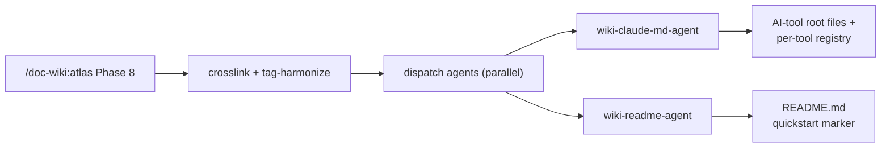
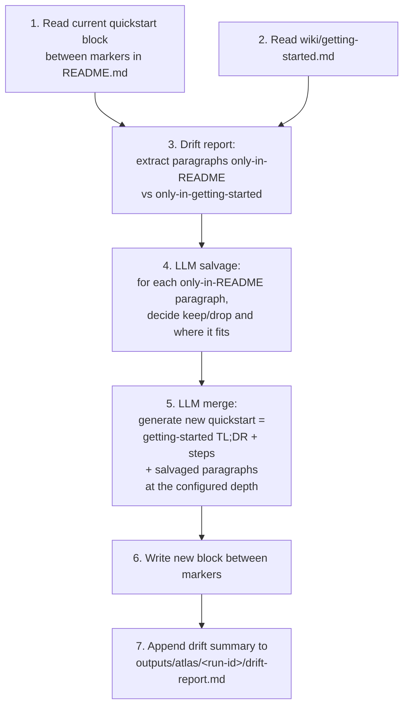

# Design — Atlas Phase 8 dispatches `wiki-claude-md-agent` and a new `wiki-readme-agent`

**Status:** approved (brainstorming) — pending implementation plan
**Date:** 2026-05-10
**Owner:** doc-wiki maintainers
**Affected:** `skills/doc-wiki/SKILL.md`, `agents/wiki-readme-agent/` (new), `skills/doc-wiki/scripts/init_wiki.ts`, `agents/lib/parse_config.ts`, root markdown stubs (CLAUDE.md / AGENTS.md / GEMINI.md), `docs/internals/architecture.md`.

## Problem

`/doc-wiki:atlas` already ships a Phase 8 step that dispatches `wiki-claude-md-agent` to refresh the AI-tool root files (`CLAUDE.md`, `AGENTS.md`, `GEMINI.md`, `.cursor/rules/doc-wiki.mdc`, `.aider/conventions.md`). That step exists in `skills/doc-wiki/SKILL.md` (Phase 8, step "Refresh the root-file Reference appendix"). The most recent atlas execution on this repo's `docs/doc-wiki-wiki/` skipped it — that's an execution bug, not a spec gap.

Separately, the repo-root `README.md` is the canonical entry point for new users, but it has no automated link to `wiki/getting-started.md`. When the wiki evolves, the README quickly drifts; manual sync is friction.

We want two outcomes:

1. **The existing dispatch actually runs** on every atlas execution, gated by config so users can opt out.
2. **A new `wiki-readme-agent`** keeps a `<!-- wiki-managed: quickstart start/end -->` block in `README.md` synced against `wiki/getting-started.md` — preserving any unique paragraphs the user has hand-authored inside the markers via an LLM-assisted salvage step.

## Non-goals

- Rewriting the entire `README.md`. The agent only owns content between the marker pair; everything outside is hand-authored.
- Generating a `README.md` when one doesn't exist. The agent's `init` action only inserts markers into an existing README.
- Cross-repo / multi-README support. Scope is the single `README.md` at the repo root.
- Replacing `wiki-claude-md-agent`. The two agents own disjoint files and are dispatched in parallel.

## Architecture

A new agent at `agents/wiki-readme-agent/`, structurally a sibling of `wiki-claude-md-agent`. Atlas Phase 8 dispatches both agents in parallel after the global crosslink + tag-harmonize hooks.

| Agent | Owns | Marker pair |
|---|---|---|
| `wiki-claude-md-agent` (existing) | `CLAUDE.md`, `AGENTS.md`, `GEMINI.md`, `.cursor/rules/doc-wiki.mdc`, `.aider/conventions.md`, `docs/<wiki-folder>/ai-dev/` registry, submodule `CLAUDE.md` | `<!-- wiki-managed: start/end -->` (legacy body), `<!-- wiki-managed: reference start/end -->` (mandatory appendix) |
| `wiki-readme-agent` (new) | `README.md` only | `<!-- wiki-managed: quickstart start/end -->` |



Both dispatches are gated independently:
- `wiki-claude-md-agent` ↔ `ecosystem.claude_md.enabled` (existing; defaults `true`).
- `wiki-readme-agent` ↔ `ecosystem.readme.enabled` (new; defaults `true`).

The two agents touch disjoint files; parallel dispatch is safe. Per-agent failures are logged to the drift report and **do not halt** Phase 8 (matches existing per-step error-isolation policy).

## `wiki-readme-agent` contract

Agent file at `agents/wiki-readme-agent/AGENT.md`. Frontmatter:

```yaml
name: wiki-readme-agent
description: |
  Repo-root README.md maintainer. Syncs the wiki-managed: quickstart
  marker block in README.md against wiki/getting-started.md, salvaging
  unique README content into the new generated quickstart via LLM
  merge. Preserves user content outside the marker pair.
type: maintenance
autonomy_level: autonomous
model: sonnet
tools: [Read, Write, Bash]
color: yellow
version: "1.0.0"
invocation_template:
  subagent_type: wiki-readme-agent
  default_model: sonnet
  label: README
```

### Actions

| Action | Inputs | Outputs |
|---|---|---|
| `sync` (default) | `project_root`, `wiki_root` | Drift-checks current README quickstart vs `wiki/getting-started.md`, runs LLM salvage, writes new quickstart between markers, returns `{status, drift_summary, salvaged_paragraphs, written: README.md}` |
| `check` | `project_root`, `wiki_root` | Drift report only — no writes. Returns same shape minus `written`. Used by CI / `--dry-run`. |
| `init` | `project_root`, `wiki_root`, `quickstart_depth: minimal\|standard\|generous` | When README has NO marker pair AND `insert_markers_on_init: true`: insert one with seed content. When marker pair exists: no-op (defer to `sync`). |

### Marker contract

```
<!-- wiki-managed: quickstart start -->
<auto-generated quickstart block>
<!-- wiki-managed: quickstart end -->
```

- HTML comments — invisible in rendered Markdown on every common renderer (GitHub strips them from output HTML).
- Removing the markers is the kill switch: agent treats README as opted-out and writes nothing.
- Missing markers on a `sync` invocation: emit a warning ("README has no quickstart markers; run `/doc-wiki:onboard` or add markers manually"). Defer actual insertion to the `init` action — never silently mutate a hand-authored README.

## Sync flow



### Step 3 — drift report shape

LLM-driven paragraph-level diff (not text-diff), so semantically-equivalent paragraphs that differ in wording are not flagged as drift:

```yaml
only_in_readme:
  - paragraph: "Note: Node 21+ isn't supported because..."
    location: "after install paragraph"
    rationale: "version-pinning warning"
only_in_getting_started:
  - paragraph: "After install, the ten /doc-wiki:* slash commands are..."
    location: "Path 1 success outcome"
    rationale: "post-install confirmation"
```

### Step 4 — LLM salvage dispositions

For each `only_in_readme` paragraph the LLM produces one of:

| Disposition | Meaning |
|---|---|
| `keep_verbatim` | Paragraph stays in the new block at its current spot. |
| `keep_reworded` | Content folded into the new block, possibly merged with a sibling paragraph from getting-started. |
| `drop_outdated` | Paragraph contradicts current wiki — drop with explanation in drift report. |
| `drop_duplicate` | Paragraph is already covered by getting-started content — drop. |
| `escalate` | Ambiguous — flag in drift report, leave in old block, do not write. |

Escalation handling depends on `salvage_mode` (which defaults to `autonomy.mode`):

- `conservative` — agent asks the user via `AskUserQuestion`.
- `balanced` / `autonomous` — agent picks the safest disposition (`keep_verbatim`) and notes it in the drift report.

### Step 5 — depth-driven generation templates

| Depth | Template |
|---|---|
| `minimal` | 1-line install + 1 first-command code block (≈5 lines total). |
| `standard` | install + first command + 2-3 follow-up bullets + 1 docs link (≈15 lines). |
| `generous` | full numbered walkthrough mirroring `wiki/getting-started.md` TL;DR + steps 1-4, with code blocks (≈30 lines). |

Salvaged paragraphs are spliced into the appropriate template slot. If no slot fits, they are appended as "Notes" at the end.

### Step 7 — drift summary integration

Atlas-triggered runs append the salvage table to `outputs/atlas/<run-id>/drift-report.md` under a `## README sync (wiki-readme-agent)` heading.

Standalone `wiki-readme-agent sync` invocations (outside atlas) write their own report at `outputs/readme/<timestamp>-drift.md`.

## Configuration

New `ecosystem.readme` block in `wiki.config.yaml`:

```yaml
ecosystem:
  readme:
    enabled: true              # default true; false skips wiki-readme-agent dispatch
    quickstart_depth: generous # minimal | standard | generous
    salvage_mode: balanced     # conservative | balanced | autonomous (defaults to autonomy.mode)
    insert_markers_on_init: true
```

| Field | Default | Effect |
|---|---|---|
| `enabled` | `true` | When `false`, atlas Phase 8 skips the `wiki-readme-agent` dispatch. Independent of `claude_md.enabled`. |
| `quickstart_depth` | `generous` | Drives the depth template in step 5. |
| `salvage_mode` | (inherits `autonomy.mode`; `auto` maps to `autonomous`) | Override the salvage step's `escalate` handling independently of overall autonomy. Valid values: `conservative`, `balanced`, `autonomous`. |
| `insert_markers_on_init` | `true` | When `true` AND README has no markers AND user agreed during `/doc-wiki:init`, the `init` action inserts an empty marker pair so the next atlas run can populate it. |

## `/doc-wiki:init` and `/doc-wiki:onboard` Q&A

One new prompt in Phase 6 of the existing onboarding (after autonomy-mode pick, before scaffold creation), via `AskUserQuestion`:

> "Do you want doc-wiki to maintain a quickstart block in your README.md? It'll be auto-generated from `wiki/getting-started.md` on every `/doc-wiki:atlas` run, with hand-edits salvaged via LLM merge. You can change this later in `wiki.config.yaml`."

| Choice | Effect |
|---|---|
| `Yes — generous (~30 lines)` | `enabled: true`, `quickstart_depth: generous`, `insert_markers_on_init: true`. Recommended default. |
| `Yes — standard (~15 lines)` | `enabled: true`, `quickstart_depth: standard`, `insert_markers_on_init: true`. |
| `Yes — minimal (~5 lines)` | `enabled: true`, `quickstart_depth: minimal`, `insert_markers_on_init: true`. |
| `No, skip` | `enabled: false`. Atlas never dispatches `wiki-readme-agent`. README is hand-only. |

**Marker insertion behaviour** (`init` action) — when `enabled: true` AND README exists AND has no marker pair AND `insert_markers_on_init: true`:

1. Read existing README; locate the install section by case-insensitive heading match: `## Install` / `## Installation` / `## Setup` / `## Get started`.
2. Insert the marker pair immediately after the install section heading. If no install section is found, insert after the first `## ` heading.
3. Inside the markers, drop the placeholder: `> Quickstart synced from wiki/getting-started.md on next /doc-wiki:atlas run.`
4. Log the insertion to `events.jsonl`.

If the user later wants to re-position the markers, they cut-and-paste them by hand — the agent only inserts on first init.

**Re-running `/doc-wiki:init` on an existing wiki**: the `init` action is idempotent. If markers exist, the agent leaves them alone. If `enabled` was changed since last init, `/doc-wiki:onboard` re-prompts via `AskUserQuestion`.

## Atlas Phase 8 spec changes

The current Phase 8 step set, with the README addition shown in **bold**:

1. Run `/doc-wiki:lint` (no `--fix`); append findings to drift report.
2. `atlas_validate.js cross-doc` scan; append findings to drift report.
3. `atlas_orchestrator.js gap-report` — write `gap-report.md`.
4. Update `wiki/index.md`.
5. Run global crosslink + tag-harmonize.
6. **Dispatch root-file agents in parallel:**
   - `Agent(wiki-claude-md-agent)` with `{action: "update", project_root, wiki_root, targets: [<all present AI-tool root files>]}` — gated on `ecosystem.claude_md.enabled` (default `true`).
   - **`Agent(wiki-readme-agent)`** with `{action: "sync", project_root, wiki_root}` — gated on `ecosystem.readme.enabled` (default `true`).
   - Both dispatches happen **after** crosslink + tag-harmonize so root-file content reflects the final wiki state.
   - The two agents touch disjoint files; parallelism is safe.
   - Per-agent failures are logged to the drift report and do not halt Phase 8.
7. `event_logger.js log --op atlas` with `details.agent_calls[]` containing one sub-entry per dispatched agent — fields: `agent`, `model`, `tokens_in`, `tokens_out`, `cost_usd`, `elapsed_ms`, `status`. event_logger automatically rolls these into `total_*` fields.
8. `clearCheckpoint(wikiRoot, "atlas")`.
9. Write `cost-report.md` (planned + actual).

### Drift report integration

The Phase 8 drift report (`outputs/atlas/<run-id>/drift-report.md`) gains two new sections, both appended after the existing lint + cross-doc findings:

```markdown
## Root-file appendix sync (wiki-claude-md-agent)

| Target | Status | Notes |
|---|---|---|
| CLAUDE.md | updated | reference appendix refreshed |
| AGENTS.md | updated | reference appendix refreshed |
| ...        | ...     | ... |

## README sync (wiki-readme-agent)

**Drift between wiki/getting-started.md and README.md quickstart:**

| Disposition | Paragraph | Action |
|---|---|---|
| keep_verbatim | "Note: Node 21+ isn't supported..." | retained at install-section anchor |
| keep_reworded | "...folded into install paragraph" | merged with getting-started "Path 1" |
| drop_outdated | "...mentions deprecated --legacy flag" | dropped; rationale: flag removed in v0.2 |

Salvage summary: 3 paragraphs kept, 1 reworded, 2 dropped.
```

### Cost-ceiling and dry-run interaction

- **Cost ceiling.** Both dispatches count toward `total_cost_usd` (typical: < $0.10 each for sonnet on a fresh sync). The mid-run abort threshold (`1.5 × --max-cost`) covers them — if cost is already over the limit by Phase 8, both dispatches are skipped, drift report records the skip, run finalizes anyway.
- **`--dry-run`.** Both agent dispatches run with `action: "check"` instead of `update`/`sync`. Drift findings are still produced; no writes happen. `wiki-claude-md-agent` gains a new `check` action with the same inputs as `update` but no filesystem writes; this aligns the two agents on a common dry-run vocabulary. (The existing `registry` action is preserved as-is — it inspects the per-tool registry only and is kept for backwards compatibility.)
- **`--scope <topic>`.** Atlas's `--scope` restricts Phase 6 to one topic. Phase 8's root-file dispatch still runs unconditionally — root files reflect the *whole* wiki state, not just the scoped topic.

## File map

### New files

```
agents/wiki-readme-agent/
├── AGENT.md                       # contract (this doc)
├── scripts/
│   ├── readme_sync.ts             # 3 actions (sync/check/init), drift+merge logic
│   ├── readme_sync.js             # built sibling
│   └── tests/
│       └── readme_sync.test.ts    # vitest
└── evals/
    └── evals.json                 # representative scenarios for /skill-creator evals
```

### Modified files

| Path | Change |
|---|---|
| `skills/doc-wiki/SKILL.md` | Phase 8 step 6 reworded for parallel two-agent dispatch. New `## /doc-wiki:onboard` Phase 6 prompt for `quickstart_depth`. New `agents/wiki-readme-agent` row in the agents architecture-summary table. |
| `agents/wiki-claude-md-agent/AGENT.md` | Document the new `check` action (no writes; same inputs as `update`). |
| `agents/wiki-claude-md-agent/scripts/claude_md_gen.ts` | Implement `check` action: dry-run path that generates the would-be content but writes nothing; returns the same response shape as `update` minus `written`. |
| `agents/wiki-claude-md-agent/scripts/tests/claude_md_gen.test.ts` | Cover the `check` action. |
| `skills/doc-wiki/scripts/init_wiki.ts` | `buildConfig()` adds the `ecosystem.readme` block with documented defaults. Constants for the depth choices. |
| `skills/doc-wiki/scripts/init_wiki.test.ts` | Cover the new defaults; assert backwards-compat (existing configs without `ecosystem.readme` still parse). |
| `agents/lib/parse_config.ts` | Validate `ecosystem.readme.{enabled, quickstart_depth, salvage_mode, insert_markers_on_init}` types and enums. Default `salvage_mode` to `autonomy.mode` when unset (mapping `auto` → `autonomous`). |
| `agents/lib/parse_config.test.ts` | New cases for the schema. |
| `CLAUDE.md`, `AGENTS.md`, `GEMINI.md` | Add the new agent to the "Agents" architecture-summary table (one row, mirroring `wiki-claude-md-agent`'s row). |
| `docs/internals/architecture.md` | Add the new agent to the agents section + diagram. |
| `commands/atlas.md` | No change. |

### Build artifact convention

Per the existing `tsconfig.build.json`, every `.ts` file under `agents/**` produces a `.js` sibling. CI's "Verify .ts/.js siblings are in sync" step covers the new files automatically.

## Migration

| Scenario | Behaviour on first `/doc-wiki:atlas` after this feature lands |
|---|---|
| Existing wiki, `wiki.config.yaml` lacks `ecosystem.readme` block | `parse_config.ts` synthesises defaults (`enabled: true`, `quickstart_depth: generous`). On the next atlas run, `wiki-readme-agent sync` finds no markers in README → emits a one-line drift entry "README has no quickstart markers; run `/doc-wiki:onboard` or add markers manually." Atlas does not fail. |
| Existing wiki, README has hand-authored quickstart but no markers | Same as above — markers must be present for the agent to write. The drift entry is a hint, not an error. |
| Existing wiki, README already has markers from a prior `init` | Sync runs normally on the next atlas. |
| Existing wiki, user sets `ecosystem.readme.enabled: false` | Agent dispatch skipped. README untouched. |

### Backfill of `docs/doc-wiki-wiki/` (the just-completed atlas run)

Once the feature ships, a one-off backfill on this very wiki:

1. Re-dispatch `wiki-claude-md-agent` (was missed in the recent atlas execution) — refreshes `CLAUDE.md` / `AGENTS.md` / `GEMINI.md` / `.cursor/rules/doc-wiki.mdc` / `.aider/conventions.md` reference appendices against the freshly-generated wiki.
2. Run `/doc-wiki:onboard` once on the existing wiki root to set the new `ecosystem.readme` config block + invite the user to insert README markers.
3. Re-run `wiki-readme-agent sync` to populate the README quickstart from `wiki/getting-started.md`.

Backfill is **not** automatic — it's a one-off post-merge step, gated on user confirmation.

## Testing

| Layer | Test |
|---|---|
| Unit | `readme_sync.test.ts` — fixture READMEs (no markers / empty markers / populated markers / markers with hand-edits / markers with deprecated content); fixture `getting-started.md` files; assert correct disposition for each salvage paragraph; assert idempotency (sync twice = same output the second time). |
| Unit | `parse_config.test.ts` — valid + invalid `ecosystem.readme` shapes; defaults populate correctly when block missing. |
| Unit | `init_wiki.test.ts` — generated `wiki.config.yaml` includes the new block. |
| Integration | Use `wiki-workspace/iteration-N` as the test harness — add a new iteration `iteration-readme-agent-1` with a fixture repo containing a README, exercise `/doc-wiki:atlas` end-to-end, assert agent dispatch + marker insertion. |
| Eval | `agents/wiki-readme-agent/evals/evals.json` — three scenarios: clean sync (no salvage needed), salvage-heavy sync (multiple `keep_reworded`), no-op sync (markers identical to last run). Run via `/skill-creator` evals. |

## Rollback

Two safety nets:

- `--dry-run` always gives a check-only output before any writes.
- The agent never deletes user content **outside** the markers; worst case is an undesired regeneration *inside* the markers, recoverable via `git restore README.md`.

## Verification

End-to-end check after implementation:

1. From a clean clone, run `/doc-wiki:init` and `/doc-wiki:onboard` on a fresh test repo. Confirm the new `quickstart_depth` prompt appears.
2. Confirm `wiki.config.yaml` includes the new `ecosystem.readme` block with the chosen depth.
3. Run `/doc-wiki:atlas`. Confirm `wiki-readme-agent sync` is dispatched in Phase 8 and writes the README markers.
4. Hand-edit a paragraph inside the README markers, re-run atlas, confirm the salvage step keeps or reworks the edit (per disposition).
5. Set `ecosystem.readme.enabled: false`, re-run atlas, confirm the agent is not dispatched and README is unchanged.
6. `npm test` passes; CI sibling-sync check passes.
