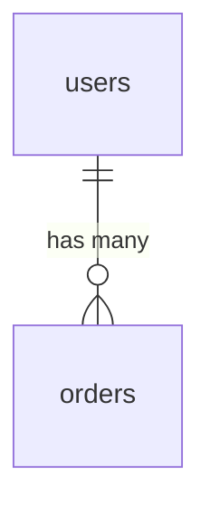

# Wiki Compilation Rules

How to compile raw sources into wiki pages. Read this during `/doc-wiki:ingest`.

## Page Types

| Type | When to use | Word target |
|---|---|---|
| `concept` | Dense explanation of an idea, technique, or architecture | 400-1200 |
| `entity` | Factual summary of a person, tool, paper, or org | 200-500 |
| `summary` | Key takeaways from a single source | 150-400 |
| `index` | Navigation hub for a topic | 150-400 |
| `lecture` | Takeaways from audio/video content | 300-800 |
| `claim` | Trackable assertion with evidence and confidence | 100-400 |
| `synthesis` | Query-derived comparison or analysis (from /doc-wiki:promote) | 300-1200 |

## Required Frontmatter

Every wiki page MUST have:

```yaml
---
title: Page Title
type: concept
tags: [authentication, jwt, session-management]
sources: [raw/auth/overview.md]
created: 2026-04-12
updated: 2026-04-12
quality: 0.0
summary: >
  Two to three line abstract used for progressive disclosure.
  This appears in summaries.md for scanning without loading the full page.
---
```

### Additional frontmatter for claims

```yaml
status: proposed                   # proposed | supported | challenged | deprecated
confidence: 0.6                   # 0.0-1.0
failure_reason: ""                 # REQUIRED when status=deprecated
evidence:
  - source: raw/topic/paper.md
    type: supports
    strength: moderate
    detail: "..."
```

### Additional frontmatter for code references (code locality)

```yaml
references:
  - path: src/auth/session.py
    lines: [42, 58]
    symbol: authenticate
    content_hash: e3b0c44298fc...
```

### Additional frontmatter for atlas pages (audience targeting)

Atlas-generated pages should include an `audience` field so readers can route to the
right depth. Five values are recognized:

- `new-user` — Reader is installing or running for the first time.
- `operator` — Reader is using the tool day-to-day; needs args, examples, recipes.
- `contributor` — Reader is modifying internals; needs architecture and contracts.
- `integrator` — Reader is wiring an external system into the project.
- `debugger` — Reader is diagnosing a failure; wants symptom → cause → fix.

Defaults inferred from `atlas_facet` when the field is absent:

| Facet | Default audience |
|---|---|
| `getting-started` | `new-user` |
| `commands`, `configuration`, `operations` | `operator` |
| `architecture`, `data-model`, `environments` | `contributor` |
| `api`, `integrations`, `deploy` | `integrator` |
| `troubleshooting` | `debugger` |
| `overview` | `contributor` |

The audience drives the page-template variant chosen for the body (see `SKILL.md`
page template) and the routing table at the top of `wiki/overview.md`.

## Link Enrichment

Before compiling a page, load ~300 characters from the top 2-3 linked pages as context. This produces better cross-references and catches contradictions at write time.

## Cross-Referencing During Compilation

When multiple source agents are active, their outputs are collected and woven into a single compilation prompt. The page should reference all contributing sources and note where they agree or conflict.

## "How to Go Deeper" Section

For pages with external source references, auto-generate:

```markdown
## How to Go Deeper

- **Database:** `wiki agent db-query dev "SELECT ... FROM ..."`
- **Jira:** `wiki agent jira --query "project = AUTH AND ..."`
- **Live code:** Read `src/auth/session.py:42-58`
```

Generation is handled by `scripts/how_to_go_deeper.ts` (compiled `how_to_go_deeper.js`). It classifies each string in the page's `sources:` frontmatter — Atlassian URLs / `jira://` → Jira, Confluence URLs / `confluence://` → Confluence, `gh://` or github.com → GitHub, `notion://` or notion.so → Notion, GCP/AWS console URLs and schemes → the respective agent, `db://env/target` → the db-query agent, code extensions with optional `:lines` → Live code. Sources under `raw/` (already ingested into the body) are elided. Pass the enabled-agents set from `wiki.config.yaml` so hints for disabled agents render as "enable the wiki-X-agent" callouts instead of unrunnable commands.

## Related Pages Section

Every compiled page MUST end with a populated `## Related Pages` section, written **at page-creation time** — not deferred to the post-op crosslink hook. Compose 3-5 hand-picked `[Title](relative/path.md)` bullets, drawing from:

- **Same-topic siblings** — other facets of the same topic (for atlas pages: e.g. `agents/architecture.md` should link `agents/api.md`, `agents/operations.md`).
- **Same-facet peers** — the same facet on neighboring topics (e.g. `agents/architecture.md` should link `skills/architecture.md`).
- **Most relevant audience-flavor globals** — `overview.md`, `integrations.md`, `deploy.md`, `commands.md`, `configuration.md`, `getting-started.md`, `troubleshooting.md`.

Do NOT emit a `<!-- crosslink hook will populate -->` (or similar deferred-fill) placeholder. The post-op crosslink hook **refines** an existing list — it adds newly-discovered relationships and prunes stale ones — but it never bootstraps the section from scratch. Pages that ship with empty / placeholder `## Related Pages` are treated as page-creation bugs by the hook's summary output.

Format:

```markdown
## Related Pages

- [Title of sibling](relative/path.md) — short relevance note
- [Title of peer](relative/path.md) — short relevance note
- [Title of global](relative/path.md) — short relevance note
```

The short relevance note (after the em-dash) is optional but recommended — it helps readers decide whether to follow the link.

## Graph Edges

After compilation, write typed relationships to `graph/edges.jsonl`:

- `supports` — evidence supports a claim or concept
- `contradicts` — evidence contradicts existing knowledge
- `extends` — builds on or refines an existing concept
- `supersedes` — replaces an older method or claim

Every edge MUST carry a provenance tag:
- `EXTRACTED` — direct source evidence (implicit confidence 1.0)
- `INFERRED` — reasonable deduction (include `provenance_score` 0.0-1.0)
- `AMBIGUOUS` — uncertain, flagged for human review

## Claims Extraction

During compilation, extract trackable assertions:
- Create/update pages in `wiki/claims/`
- Link claims to source pages via edges.jsonl
- Set initial confidence based on evidence strength

## Tag Rules

Tags represent concepts, theories, and models ONLY:
- Named theories: `ELM-model`, `transformer-architecture`
- Core subjects: `consumer-behavior`, `distributed-systems`
- Specific techniques: `A-B-testing`, `gradient-descent`
- Cross-cutting themes on 2+ pages

Tags to EXCLUDE:
- Page-type tags: `concept`, `entity` (the `type` field handles this)
- Numbering: `chapter-5`, `section-3`
- Temporal: `april-2026`, `Q2-2026`
- Generic metadata: `important`, `reference`, `draft`

Target: 4-8 concept tags per page.

## Mermaid Diagrams

Generate Mermaid diagrams inline when the source data is structural:
- `erDiagram` for database entity relationships
- `sequenceDiagram` for request flows
- `graph TB` for service topology or architecture
- `classDiagram` for ORM entities
- `graph LR` for dependency graphs

Wrap in fenced code blocks:
````markdown

````

Splicing is handled deterministically by `scripts/mermaid_inject.ts`. Every source / mapper agent that produces diagram-worthy data returns a `mermaid: { type, title, code }` envelope in its JSON output (see `agents/lib/mermaid_format.ts` for the shared builders `formatGraph` and `formatErDiagram`). The injector collects those envelopes during `/doc-wiki:ingest` step 9 and wraps each in `<!-- wiki-mermaid: <title> start/end -->` markers, so re-running an ingest replaces stale blocks in place rather than stacking duplicates. Agents that don't produce a diagram MUST omit the `mermaid` field entirely — do not emit an empty envelope.
