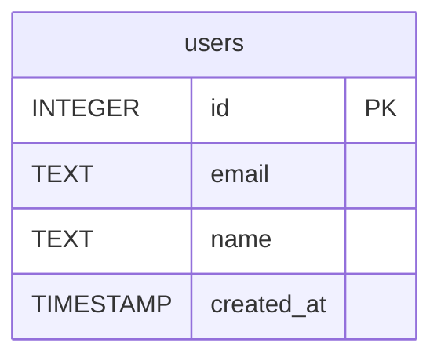

# Schema: `users` table (dev)

**Database:** `/tmp/eval-db-schema/dev.sqlite` (SQLite)
**Environment:** `dev` (approval_mode=auto, grant_duration_hours=8)
**Introspection path:** `db_query.js --action schema --filter users`

## Columns

| # | Column       | Data type | Nullable | Primary key | Default             |
|---|--------------|-----------|----------|-------------|---------------------|
| 1 | `id`         | INTEGER   | yes*     | yes         | (none)              |
| 2 | `email`      | TEXT      | no       | no          | (none)              |
| 3 | `name`       | TEXT      | yes      | no          | (none)              |
| 4 | `created_at` | TIMESTAMP | yes      | no          | `CURRENT_TIMESTAMP` |

\* SQLite's `PRAGMA table_info` reports the PK column with `notnull=0` because
`INTEGER PRIMARY KEY` is an alias for `ROWID` — the column cannot actually
hold NULL even though the flag reads as nullable. The other columns' flags
are accurate.

## Constraints

- `PRIMARY KEY (id)` (INTEGER PRIMARY KEY — alias for ROWID)
- `UNIQUE (email)` and `NOT NULL (email)` — inferred from the DDL
  (`email TEXT NOT NULL UNIQUE`). Note: SQLite surfaces the UNIQUE
  constraint as an auto-created index rather than as a column-info flag,
  so it is not visible in `PRAGMA table_info` output. The DDL in
  `sqlite_master` confirms both the UNIQUE and NOT NULL.

## ER diagram (auto-generated by the agent)



## Raw agent output (schema action)

```json
{
  "status": "ok",
  "tables": [
    {
      "name": "users",
      "schema": "",
      "columns": [
        { "name": "id",         "data_type": "INTEGER",   "nullable": true,  "is_primary_key": true,  "default": null },
        { "name": "email",      "data_type": "TEXT",      "nullable": false, "is_primary_key": false, "default": null },
        { "name": "name",       "data_type": "TEXT",      "nullable": true,  "is_primary_key": false, "default": null },
        { "name": "created_at", "data_type": "TIMESTAMP", "nullable": true,  "is_primary_key": false, "default": "CURRENT_TIMESTAMP" }
      ]
    }
  ],
  "table_count": 1
}
```

## Equivalent bounded SELECT (policy-gated ALLOW path)

```sql
SELECT name, type, "notnull", dflt_value, pk
FROM pragma_table_info('users')
LIMIT 100
```

Returned 4 rows through the policy gate with `status: "ok"` (Decision=ALLOW,
reason="auto-approved"). See `policy-decision.json`.
