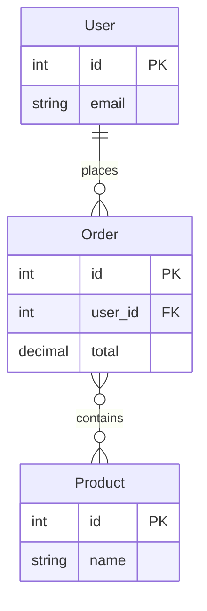

# Schema overview
Preamble that should not be touched.
<!-- wiki-mermaid: start -->
(empty)
<!-- wiki-mermaid: end -->
Trailing paragraph that should also not be touched.

## Diagrams

%% Title: User / Order / Product schema

