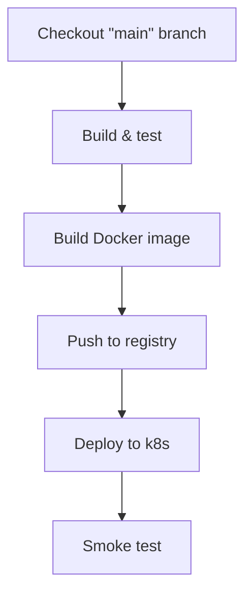

# Deploy Pipeline

This page documents the end-to-end deploy pipeline for the service. The flow
begins when a commit lands on `main` and ends once the freshly-rolled-out
pods pass smoke tests in the target cluster.

## Overview

The deploy pipeline is composed of six stages, each of which must succeed
before the next stage runs. A failure at any stage halts the pipeline and
surfaces the error in the CI dashboard.

## Diagrams

%% Title: Deploy Pipeline

## Operational notes

- Rollbacks are handled by re-running the previous commit's pipeline.
- Smoke tests hit the `/healthz` endpoint of three canary pods.
- On-call owns the first hour post-deploy; see the runbook for escalation.
