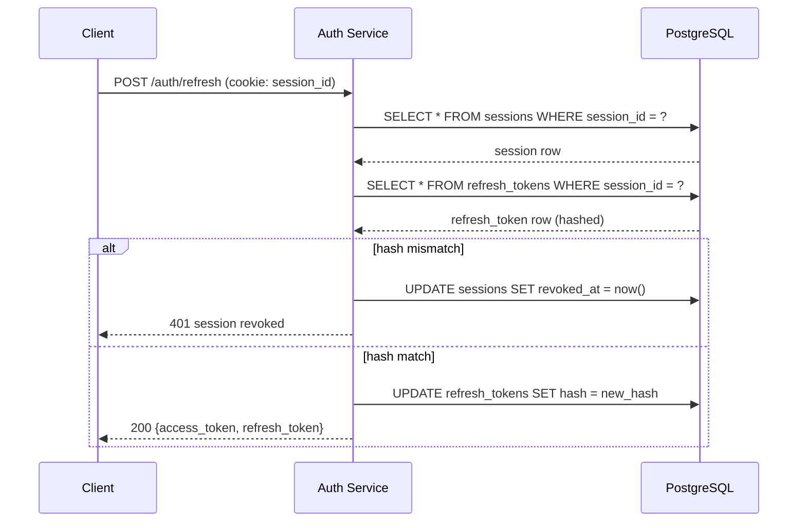
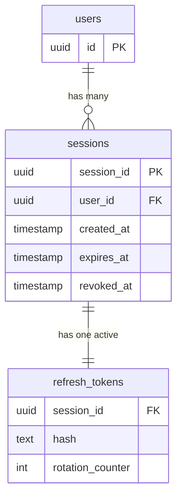

# Authentication and Session Management

The auth service uses a **hybrid model**: stateless JWT access tokens for per-request authorization, combined with server-side session records that give operators the ability to forcibly revoke access. This balances the latency/scale benefits of stateless tokens with the operational need to invalidate a session on demand (logout, forced sign-out, anomaly detection).

## Access tokens (JWT / RS256)

Access tokens are **JSON Web Tokens signed with RS256** (RSA + SHA-256). The private signing key lives in a secrets manager and is only accessible to the auth service. Public keys are published at a JWKS endpoint (`/.well-known/jwks.json`) so downstream services can verify tokens without a shared secret.

Token properties:

- **Expiry:** 15 minutes (default). The short lifetime is the primary revocation mechanism — downstream services do not query the session store on every request.
- **Claims:** `sub` (user ID), `sid` (server-side session ID), `scope` (permission array), `iat`/`exp` (timestamps), `iss` (issuer URL).
- **Verification:** downstream services verify the JWT signature against JWKS, check `exp`, and enforce scopes.

## Server-side sessions (PostgreSQL)

Every authenticated user also has a **session row in PostgreSQL**, keyed by an opaque `session_id` value set as an HTTP-only, `Secure`, `SameSite=Lax` cookie on the auth domain.

Table: `sessions`

| Column | Purpose |
|---|---|
| `session_id` (UUID, PK) | Opaque server-side identifier, echoed in the cookie |
| `user_id` (FK `users.id`) | Owning user |
| `created_at`, `last_seen_at`, `expires_at` | Lifetime tracking |
| `ip_address`, `user_agent` | Audit and anomaly detection |
| `revoked_at` (nullable) | Set when a session is explicitly invalidated |

Sessions enforce an absolute lifetime (default 30 days) and an idle timeout (default 7 days). A valid, non-revoked session is what authorizes the auth service to mint new access tokens without re-prompting the user for credentials.

## Refresh flow (/auth/refresh)

Because access tokens expire quickly, clients rotate them via `POST /auth/refresh`:

1. Client sends the request with the `session_id` cookie attached.
2. Auth service looks up the session row and verifies it is present, not revoked, and not expired.
3. Service looks up the associated entry in a separate `refresh_tokens` table, which stores a **hashed** refresh secret and a rotation counter.
4. If the presented refresh token does not match the current hash, the entire session is revoked (protects against refresh-token theft).
5. On success, the refresh token is rotated (new random value, hash stored, old hash invalidated), a new JWT is minted, and both are returned to the client.

## Logout / session invalidation

On logout the auth service:

1. Sets `revoked_at = now()` on the session row.
2. Deletes all associated rows from `refresh_tokens`.
3. Clears the `session_id` cookie on the client.

Existing access tokens still validate cryptographically until their `exp` passes (up to 15 minutes), but no new access tokens can be minted from a revoked session. This bounded-window tradeoff is intentional: it keeps the hot path stateless while keeping revocation latency to at most one token lifetime.

## Entity relationships

## How to Go Deeper

- **Live source:** [`raw/auth/architecture.md`](../../raw/auth/architecture.md)
- **Database (when enabled):** inspect schema with `wiki agent db-query dev "\\d sessions"` and `wiki agent db-query dev "\\d refresh_tokens"`
- **JWKS endpoint:** fetch `GET /.well-known/jwks.json` to see active signing keys
- **Verify token behavior:** call `POST /auth/refresh` with a session cookie and compare rotation-counter increments in the `refresh_tokens` row before and after

## Related Pages

- [Wiki index](../index.md)
- [Summaries](../summaries.md)
