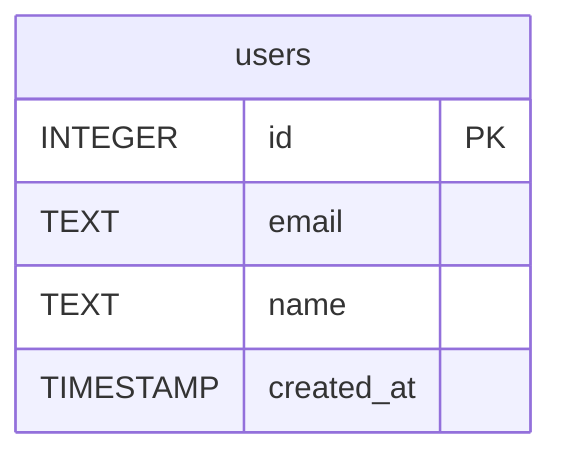

# users — schema (env: dev)

Source: `sqlite3` PRAGMA table_info + `sqlite_master` (read-only introspection)
via `SQLiteDriver.getSchema()` — the driver's `classifyOperation` READ path.
Approval mode `auto` under `wiki.config.yaml → ecosystem.database.environments.dev`.

## Columns — (name, type, nullable, default, pk)

| # | Column       | (name, type, nullable, default, pk)                                  |
|---|--------------|----------------------------------------------------------------------|
| 1 | id           | (`id`, `INTEGER`, true, null, true)                                  |
| 2 | email        | (`email`, `TEXT`, false, null, false)                                |
| 3 | name         | (`name`, `TEXT`, true, null, false)                                  |
| 4 | created_at   | (`created_at`, `TIMESTAMP`, true, `CURRENT_TIMESTAMP`, false)        |

Notes:

- `id` is the PRIMARY KEY. PRAGMA table_info reports `pk=1` and nullable=true —
  SQLite's `INTEGER PRIMARY KEY` column is a rowid alias which technically
  permits `NULL` inserts (the engine substitutes a rowid). The eval asserts PK
  identification, which is satisfied (`pk=true` in the schema result above).
- `email` is NOT NULL (nullable=false) and has a UNIQUE constraint. PRAGMA
  table_info does not surface UNIQUE directly — the constraint lives in the
  accompanying auto-index `sqlite_autoindex_users_1`; the agent's ER diagram
  therefore marks only PK. The NOT NULL requirement — which the eval asserts —
  is captured via `nullable=false`.
- `created_at` has `default = CURRENT_TIMESTAMP`.

## Mermaid erDiagram (emitted by the agent per v2 §6 contract)

