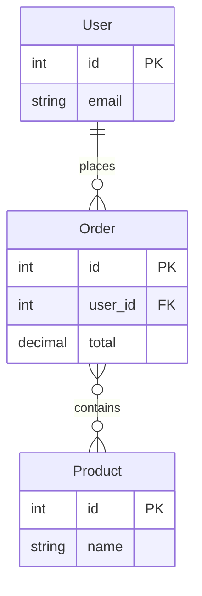

# marker-injection-check

Target file: `/tmp/eval-i3-mermaid-er/target.md` (mirrored at `outputs/target-after.md`).

## Marker / fence positions (byte offsets in target-after.md, length = 435)

| Landmark                | Byte index |
|-------------------------|-----------:|
| `<!-- wiki-mermaid: start -->` | 98 |
| ```` ```mermaid ```` (fence open) | 144 |
| Last ` ``` ` (fence close) | 359 |
| `<!-- wiki-mermaid: end -->`   | 363 |
| EOF                     | 435 |

Because `144 > 98` and `359 < 363 < 435`, the fenced block is strictly **between** the start and end markers. The last character of the file is the newline after `Trailing paragraph that must not be touched.` — the mermaid block is **not** at EOF.

```
fence_between_markers = true
fence_appended_at_eof = false
tail_of_file = "rmaid: end -->\nTrailing paragraph that must not be touched.\n"
```

## Rendered block (between markers)

```text
<!-- wiki-mermaid: start -->
%% Title: Schema

<!-- wiki-mermaid: end -->
```

## Entity + attribute coverage

| Entity  | Present | Attributes observed                     |
|---------|:------: |------------------------------------------|
| User    | yes     | `int id PK`, `string email`              |
| Order   | yes     | `int id PK`, `int user_id FK`, `decimal total` |
| Product | yes     | `int id PK`, `string name`               |

All three input entities and every attribute from the input JSON are emitted verbatim inside the fenced block.

## Cardinality check

The one-to-many edge `User ||--o{ Order : places` is preserved verbatim — `||--o{` is present in the output. The many-to-many `Order }o--o{ Product : contains` is also preserved.

## Summary

- Block lives **between** `<!-- wiki-mermaid: start -->` / `<!-- wiki-mermaid: end -->`.
- Block is **not** appended at EOF.
- All three entities and their attributes are present inside the block.
- `||--o{` is emitted for the one-to-many User→Order edge.
