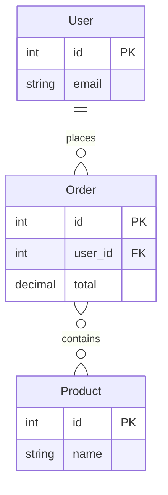

# Schema overview
Preamble paragraph that must not be touched.
<!-- wiki-mermaid: start -->
%% Title: Schema

```mermaid
erDiagram
    User ||--o{ Order : places
    Order }o--o{ Product : contains
    User { int id PK string email }
    Order { int id PK int user_id FK decimal total }
    Product { int id PK string name }
```
<!-- wiki-mermaid: end -->
Trailing paragraph that must not be touched.
