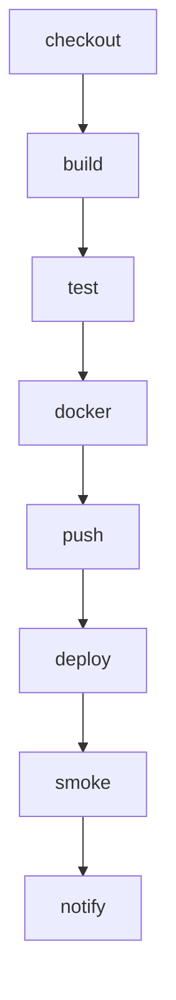

# Deploy Pipeline

This page documents the deploy pipeline.

<!-- wiki-mermaid: start -->
%% Title: Deploy

<!-- wiki-mermaid: end -->

## Operational notes

On-call: @deploy-team. Rollbacks are automatic if the smoke check fails.
