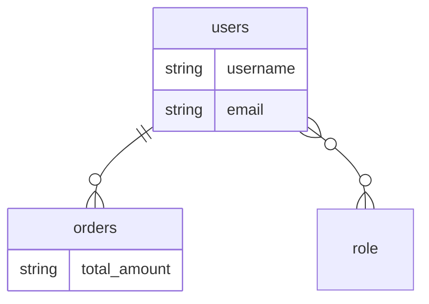

# mermaid-er-check — F3 phantom/_rel & users↔orders assertions

Source: `database-mapping.md` mermaid block (this same run).

## Mermaid block under test



## Assertions

### (a) No `_rel` phantom anywhere

Grep of the entire `database-mapping.md` for the substring `_rel`:

- Matches: **0**

Result: **PASS** — no synthetic `<something>_rel` node names leaked into
the diagram. Both edges terminate at real extracted nodes.

### (b) Edge between `users` and `orders` using `||--o{` or `}o--o{`

Literal line present in the block:

```
users ||--o{ orders : ""
```

Result: **PASS** — the one-to-many edge from `users` to `orders` is emitted
with the correct JPA cardinality (`||--o{`, one → many), using real table
names at both endpoints (not entity class names, not `_rel` phantoms).

### (c) Both `users` and `orders` appear as literal node names

Node declarations in the block:

- `orders { string total_amount }` — present
- `users  { string username; string email }` — present

Result: **PASS** — both tables are declared as ER nodes with at least one
attribute each.

## Overall

F3 fix verified: `extractor.ts` resolves `target_entity` from the JPA
field declaration and `output.ts` renders both endpoints using the
resolved entity's `table_name`, never a `<class>_rel` placeholder.
