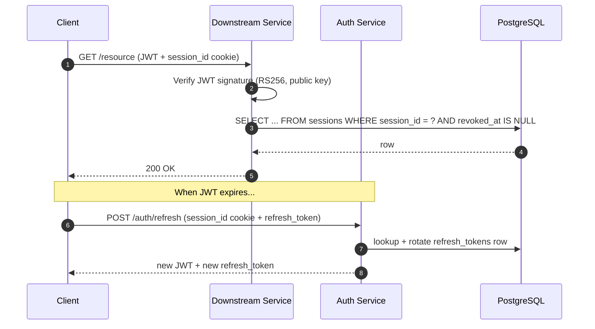

# Authentication & Session Management Overview

This topic hub covers how our backend services authenticate users and manage
their session state. The design pairs stateless JWT verification on the hot path
with a stateful server-side session record that acts as the source of truth for
liveness and revocation.

## Sub-topics

- [JWT Access Tokens (RS256)](./jwt.md) — how the access token itself is
  signed, verified, and scoped.
- [Server-Side Sessions](./sessions.md) — the PostgreSQL `sessions` table,
  the `session_id` cookie, and revocation semantics.
- [Refresh Endpoint](./refresh.md) — `POST /auth/refresh`, the
  `refresh_tokens` table, rotation, and logout behavior.

## Request Flow (Big Picture)

## Core Design Points

1. **Asymmetric signing (RS256)** so downstream services hold only the public
   key. A compromised microservice cannot mint new tokens.
2. **Short access-token TTL (15 minutes)** limits the blast radius of a leaked
   JWT.
3. **Server-side sessions** give us an immediate revocation path even though
   any still-valid JWT survives until its `exp`.
4. **Cookie + JWT pairing** means both a valid signature and a valid
   `session_id` cookie are required.
5. **Refresh-token rotation** turns replay attempts into detectable anomalies.

## Related Pages

- [JWT Access Tokens](./jwt.md)
- [Server-Side Sessions](./sessions.md)
- [Refresh Endpoint](./refresh.md)
- [Claim: Logout Revokes All Tokens](../claims/logout-revokes-all-tokens.md)

## How to Go Deeper

- **Database (PostgreSQL):** `wiki agent db-query dev "SELECT session_id,
  revoked_at FROM sessions WHERE user_id = $1"`
- **Live source:** Read `/tmp/eval-i3-iiq-project/docs/architecture.md`
- **Raw ingested copy:** [raw/docs/architecture.md](../../raw/docs/architecture.md)
