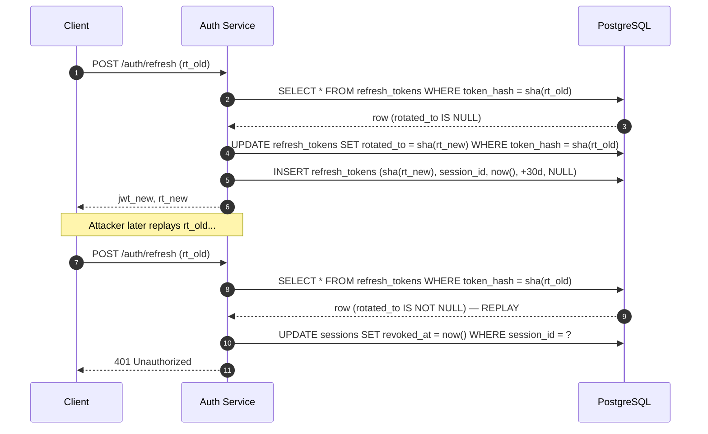

# Refresh Endpoint and Token Lifecycle

The short 15-minute lifetime of [JWT access tokens](./jwt.md) means clients
refresh frequently. The refresh path is deliberately the only way to extend a
session — clients do not re-post credentials to the login endpoint between
logins.

## Endpoint: `POST /auth/refresh`

The endpoint reads two pieces of client state:

1. The `session_id` cookie (set on login, HttpOnly).
2. A long-lived `refresh_token`, also set as a cookie on login.

It then:

1. Looks up the `sessions` row by `session_id`; rejects if missing or if
   `revoked_at` is non-null.
2. Looks up the `refresh_tokens` row by the hash of the supplied refresh
   token; rejects if missing, expired, or already rotated.
3. Mints a new 15-minute JWT bound to the same `session_id`.
4. Rotates the refresh token: the old row's `rotated_to` field is set to the
   hash of the new token and a new `refresh_tokens` row is inserted.
5. Returns the new JWT and new refresh token to the client.

## `refresh_tokens` Schema

```sql
CREATE TABLE refresh_tokens (
    token_hash   BYTEA PRIMARY KEY,
    session_id   UUID NOT NULL REFERENCES sessions(session_id),
    issued_at    TIMESTAMPTZ NOT NULL DEFAULT now(),
    expires_at   TIMESTAMPTZ NOT NULL,
    rotated_to   BYTEA NULL
);
```

Only the *hash* of the token is stored, so an attacker who dumps the table
cannot use the tokens themselves. The `rotated_to` field is what makes
replay detection work: if a token that has already been rotated is ever
presented again, the server knows that either the legitimate client or the
attacker has the stale copy — and the safe response is to revoke the
entire session.

## Logout

`POST /auth/logout` is the counterpart:

1. Set `revoked_at = now()` on the `sessions` row.
2. Delete every `refresh_tokens` row where `session_id` matches.

Both writes happen in a single transaction, so after logout no token thread
attached to that session can be extended. Any still-valid JWT still survives
until its `exp` (at most 15 minutes) but cannot be refreshed and is rejected
by any sensitive-operation guard that re-checks the session.

## Rotation and Replay Detection



## Related Pages

- [Authentication Overview](./overview.md)
- [JWT Access Tokens](./jwt.md)
- [Server-Side Sessions](./sessions.md)
- [Claim: Logout Revokes All Tokens](../claims/logout-revokes-all-tokens.md)

## How to Go Deeper

- **Database:** `wiki agent db-query dev "SELECT token_hash, session_id,
  rotated_to FROM refresh_tokens WHERE session_id = $1"`
- **Raw source:** [raw/docs/architecture.md](../../raw/docs/architecture.md)
