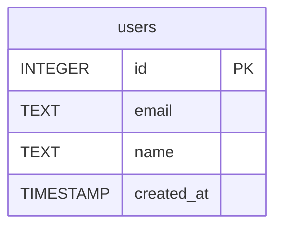

# Schema: `users` (dev / sqlite)

Reconstructed from the agent's JSON on stdout (see `stdout.txt`). Source:
`PRAGMA table_info('users')` via `SQLiteDriver.getSchema()` — the
`classifyOperation` READ path in `wiki_db/drivers/sqlite.ts`, not an ad-hoc
`SELECT *`.

## Columns

| # | Column       | Type       | Nullable | Primary Key | Default              |
|---|--------------|------------|----------|-------------|----------------------|
| 1 | `id`         | INTEGER    | true     | yes         | null                 |
| 2 | `email`      | TEXT       | **false**| no          | null                 |
| 3 | `name`       | TEXT       | true     | no          | null                 |
| 4 | `created_at` | TIMESTAMP  | true     | no          | `CURRENT_TIMESTAMP`  |

Notes:

- `id` is the integer primary key (SQLite rowid alias).
- `email` carries a `NOT NULL` constraint plus a `UNIQUE` index (the
  uniqueness does not surface in PRAGMA column metadata but is part of
  the fixture's CREATE TABLE).
- `table_count` from the agent response: **1**.

## Mermaid ER diagram

Emitted verbatim in the `mermaid.code` field of the JSON response (per
the wiki-db-agent AGENT.md contract that mandates Mermaid on schema
queries):

