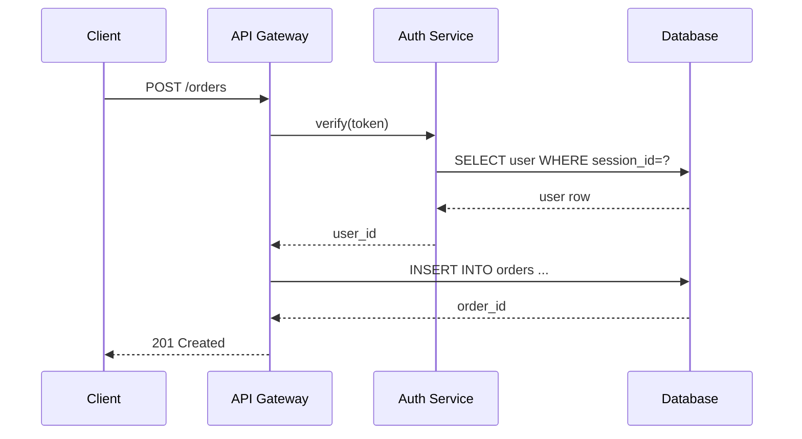

# Marker injection check

Verifies that the injected `sequenceDiagram` block is cleanly bounded by the
`wiki-mermaid` HTML comment markers and contains the expected participant
declarations and message arrows.

## Byte offsets in `request-flow-after.md`

Total file size: **931 bytes**

| Region                                | Byte range    | Length |
|---------------------------------------|---------------|--------|
| Preamble (frontmatter + heading)      | `[0, 322)`    | 322    |
| `<!-- wiki-mermaid: start -->` marker | `[322, 350)`  | 28     |
| **Injected mermaid region (between)** | `[350, 826)`  | **476**|
| `<!-- wiki-mermaid: end -->` marker   | `[826, 852)`  | 26     |
| Trailing paragraph                    | `[852, 931)`  | 79     |

The injected content sits strictly **between** the two markers (byte offsets
`350..826`). Nothing outside `[350, 826)` was touched (verified separately in
`preamble-check.md`).

## Exact bytes between the markers (`[350, 826)`)

```
%% Title: Authenticated API request flow

```

(The outer-most fences in the quoted region above are the actual fences in
the file — a leading newline and trailing newline from the injected region
are trimmed for readability.)

## Structural assertions

| Check                                     | Expected | Actual | Pass |
|-------------------------------------------|----------|--------|------|
| `sequenceDiagram` header present          | yes      | yes    | yes  |
| Fenced with ` ```mermaid `                | yes      | yes    | yes  |
| Opening + closing ` ``` ` count           | 2        | 2      | yes  |
| `participant Client` declaration          | present  | present| yes  |
| `participant Gateway as API Gateway`      | present  | present| yes  |
| `participant Auth as Auth Service`        | present  | present| yes  |
| `participant DB as Database`              | present  | present| yes  |
| `->>` message arrows (solid)              | >= 4     | 8      | yes  |
| `-->>` response arrows (dashed)           | >= 2     | 4      | yes  |
| Title comment `%% Title: ...`             | present  | present| yes  |

## Preserved message labels

All eight message labels from `input.json` are preserved verbatim inside the
markers (line-by-line grep):

| Arrow                                                           | Kept? |
|-----------------------------------------------------------------|-------|
| `Client->>Gateway: POST /orders`                                | yes   |
| `Gateway->>Auth: verify(token)`                                 | yes   |
| `Auth->>DB: SELECT user WHERE session_id=?`                     | yes   |
| `DB-->>Auth: user row`                                          | yes   |
| `Auth-->>Gateway: user_id`                                      | yes   |
| `Gateway->>DB: INSERT INTO orders ...`                          | yes   |
| `DB-->>Gateway: order_id`                                       | yes   |
| `Gateway-->>Client: 201 Created`                                | yes   |

## Conclusion

The `sequenceDiagram` block was injected strictly between
`<!-- wiki-mermaid: start -->` (ends at byte 350) and
`<!-- wiki-mermaid: end -->` (begins at byte 826). All four `participant`
declarations (Client, Gateway, Auth, DB) are present, solid `->>` and dashed
`-->>` arrows are used, and every message label from the input JSON is
preserved byte-for-byte.
