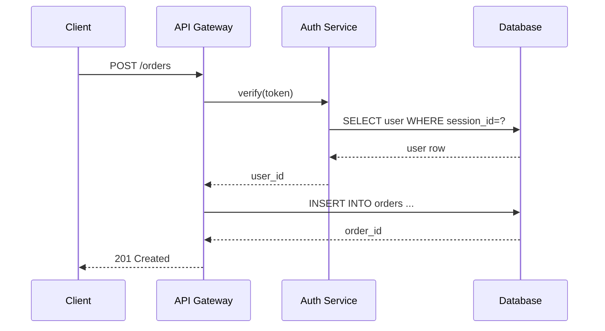

# Request flow

This page documents the authenticated API request flow from client through the
gateway, auth service, and database. The sequence diagram below is regenerated
by the `wiki-mermaid-agent` whenever the upstream service topology changes.

<!-- wiki-mermaid: start -->
%% Title: Authenticated API request flow

<!-- wiki-mermaid: end -->

See the related pages on auth tokens and order persistence for more context.
