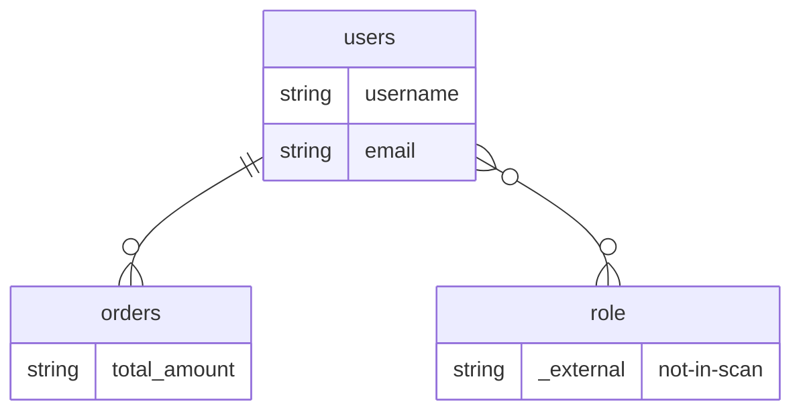

## Entity-Table Mapping

| Entity Class | Schema.Table | Columns | Relationships |
|---|---|---|---|
| Order | orders | 1 | many_to_one |
| User | public.users | 2 | one_to_many, many_to_many |

## Entity Relationship Diagram

## How to Go Deeper

This page was compiled from ORM source files. Use these commands to verify or update the information against the live database:

- **Order** (`orders`)
  - Columns: `wiki agent db-query dev "SELECT column_name, data_type FROM information_schema.columns WHERE table_name = 'orders'"`
  - Sample rows: `wiki agent db-query dev "SELECT * FROM orders LIMIT 5"`
- **User** (`public.users`)
  - Columns: `wiki agent db-query dev "SELECT column_name, data_type FROM information_schema.columns WHERE table_name = 'users'"`
  - Sample rows: `wiki agent db-query dev "SELECT * FROM public.users LIMIT 5"`
- **Live code:** Read `/Users/narayan/src/doc-wiki/agents/lib/wiki_orm/tests/fixtures/jpa/Order.java`, `/Users/narayan/src/doc-wiki/agents/lib/wiki_orm/tests/fixtures/jpa/User.java` — ORM source files this mapping was extracted from.
