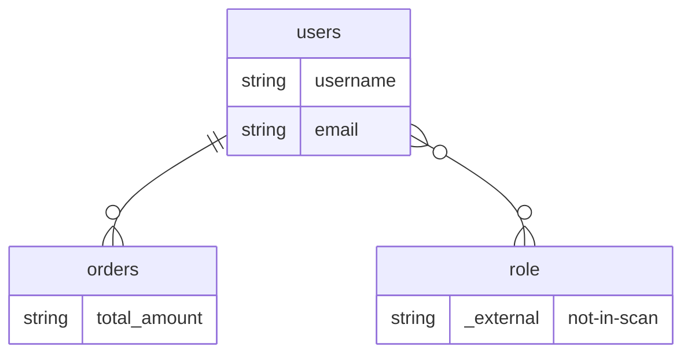

# Mermaid ER Check — R2 external-target stub verification

Fixture: `.claude/agents/lib/wiki_orm/tests/fixtures/jpa/` has `User.java`, `Order.java`, `UserRepository.java`. **`Role.java` is NOT present**, yet `User` declares `@ManyToMany List<Role> roles`. R2 requires `output.ts` to emit a **stub node** for external targets before they appear in an edge.

## (a) No `_rel` phantom node

```bash
grep -n "_rel" database-mapping.md
# exit 1  (no matches)
```

**PASS** — no `_rel`-suffixed phantom nodes in the diagram.

## (b) `users ↔ orders` edge present

```bash
grep -n "users ||--o{ orders" database-mapping.md
# 33:    users ||--o{ orders : ""
```

**PASS** — `users ||--o{ orders` edge is emitted from the `@OneToMany` on `User.orders` / `@ManyToOne` on `Order.user`.

## (c) `role { ... }` stub appears BEFORE `users }o--o{ role` edge — R2 fix

Byte offsets and line numbers computed against the generated `database-mapping.md`:

| Artifact                         | Line | Byte offset |
|----------------------------------|------|-------------|
| `    role {` stub block opener   | 30   | 593         |
| `    users }o--o{ role : ""` edge| 34   | 682         |

Relation: `stub_line (30) < edge_line (34)` and `stub_offset (593) < edge_offset (682)` → **stub precedes edge**.

### Excerpt (verbatim from `database-mapping.md` lines 21-35)



The `role` node is declared as a proper ER entity block with a marker column `string _external "not-in-scan"` **before** any edge references it. This is the R2 output.ts behavior: when a relationship target entity was not scanned (e.g., `Role` is referenced from `User` but no `Role.java` exists in the fixture), `output.ts` emits a stub node ahead of the edge so Mermaid renders it as an explicit (external) entity rather than an implicit placeholder.

## Verdict: R2 PASS

- (a) No phantom `_rel` nodes — PASS
- (b) `users ↔ orders` edge emitted — PASS
- (c) `role { ... }` stub precedes `users }o--o{ role` edge (line 30 < 34; offset 593 < 682) — PASS

Mermaid lint (`mermaid-lint.txt`) returned `[]` — no syntax issues.
