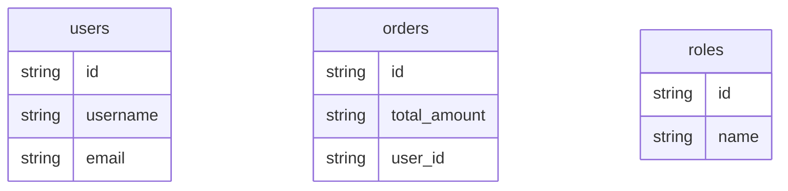

## Entity-Table Mapping

| Entity Class | Schema.Table | Columns | Relationships |
|---|---|---|---|
| User | users | 3 | relationship, relationship |
| Order | orders | 3 | relationship, foreign_key |
| Role | roles | 2 | — |

## Entity Relationship Diagram

## How to Go Deeper

This page was compiled from ORM source files. Use these commands to verify or update the information against the live database:

- **User** (`users`)
  - Columns: `wiki agent db-query dev "SELECT column_name, data_type FROM information_schema.columns WHERE table_name = 'users'"`
  - Sample rows: `wiki agent db-query dev "SELECT * FROM users LIMIT 5"`
- **Order** (`orders`)
  - Columns: `wiki agent db-query dev "SELECT column_name, data_type FROM information_schema.columns WHERE table_name = 'orders'"`
  - Sample rows: `wiki agent db-query dev "SELECT * FROM orders LIMIT 5"`
- **Role** (`roles`)
  - Columns: `wiki agent db-query dev "SELECT column_name, data_type FROM information_schema.columns WHERE table_name = 'roles'"`
  - Sample rows: `wiki agent db-query dev "SELECT * FROM roles LIMIT 5"`
- **Live code:** Read `/Users/narayan/src/doc-wiki/.claude/agents/lib/wiki_orm/tests/fixtures/sqlalchemy/models.py` — ORM source files this mapping was extracted from.
