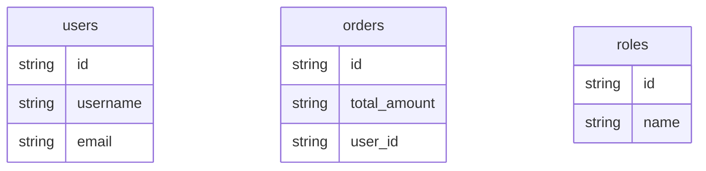

# Mermaid ER Diagram Check — SQLAlchemy Fixture

## The Emitted Mermaid Block

From `database-mapping.md`:

````

````

## Node Coverage (Entities)

| Entity   | table_name | Node present in mermaid? |
|----------|------------|--------------------------|
| `User`   | `users`    | Yes                      |
| `Order`  | `orders`   | Yes                      |
| `Role`   | `roles`    | Yes                      |

Expected: **3 nodes**. Found: **3 nodes**. All entities have a node.

## Column Coverage

| Node    | Columns emitted                      | Expected count | OK |
|---------|--------------------------------------|----------------|----|
| `users` | `id`, `username`, `email`            | 3              | Yes |
| `orders`| `id`, `total_amount`, `user_id`      | 3              | Yes |
| `roles` | `id`, `name`                         | 2              | Yes |

All columns per entity match the source `Column(...)` declarations.

## Edge Coverage

Edges in the emitted block: **0** (no `||--o{`, `||--||`, `}o--o{`, or similar ER connectors).

Ground-truth expected edges:
- `users ||--o{ orders` (User O2M Order via `user_id` FK + `relationship` back_populates)
- `users }o--o{ roles` (User M2M Role via `user_roles` secondary table)

## Edge Requirement Check

Spec asks: "at least one edge."
Observed: **zero edges** in the emitted erDiagram. The diagram renders per-table column lists but does not emit relationship connectors between `users`↔`orders` or `users`↔`roles`.

This is a **gap vs. the spec's "at least one edge" expectation**, even though:
- The relationships are correctly captured in `detected-entities.json` (User has 2 relationship entries, Order has 1 relationship + 1 foreign_key).
- The table-level Mermaid syntax itself is valid (mermaid_lint returned `[]` — no errors).

The missing edges are a Mermaid renderer feature gap in the ORM agent, not an extraction bug.

## Lint Status

`mermaid_lint.js --page database-mapping.md` -> `[]` (no errors). Syntax is valid.

**Summary:** All 3 entity nodes present with correct columns; mermaid syntax is lint-clean; however, **no ER edges are emitted**, so the "at least one edge" sub-check is NOT satisfied by the current output.
