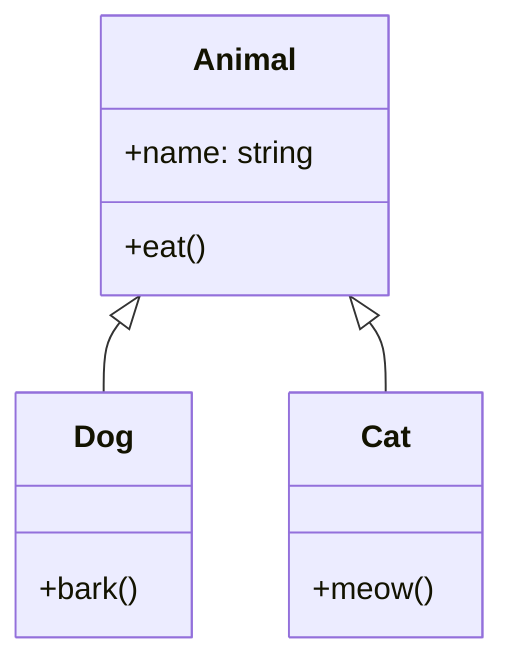

# Class hierarchy

Some preamble text.

<!-- wiki-mermaid: start -->
%% Title: Class Hierarchy

```mermaid
classDiagram
    class Animal {
        +name: string
        +eat()
    }
    class Dog {
        +bark()
    }
    class Cat {
        +meow()
    }
    Animal <|-- Dog
    Animal <|-- Cat
```
<!-- wiki-mermaid: end -->

Post-marker text that must be preserved byte-for-byte.
