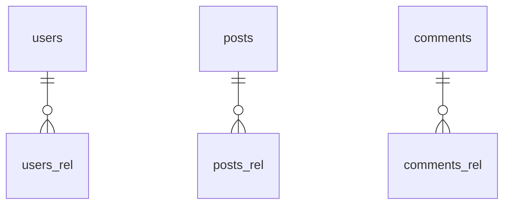

## Entity-Table Mapping

| Entity Class | Schema.Table | Columns | Relationships |
|---|---|---|---|
| User | users | 0 | one_to_many |
| Post | posts | 0 | relationship, one_to_many |
| Comment | comments | 0 | relationship |

## Entity Relationship Diagram

## How to Go Deeper

This page was compiled from ORM source files. Use these commands to verify or update the information against the live database:

- **User** (`users`)
  - Columns: `wiki agent db-query dev "SELECT column_name, data_type FROM information_schema.columns WHERE table_name = 'users'"`
  - Sample rows: `wiki agent db-query dev "SELECT * FROM users LIMIT 5"`
- **Post** (`posts`)
  - Columns: `wiki agent db-query dev "SELECT column_name, data_type FROM information_schema.columns WHERE table_name = 'posts'"`
  - Sample rows: `wiki agent db-query dev "SELECT * FROM posts LIMIT 5"`
- **Comment** (`comments`)
  - Columns: `wiki agent db-query dev "SELECT column_name, data_type FROM information_schema.columns WHERE table_name = 'comments'"`
  - Sample rows: `wiki agent db-query dev "SELECT * FROM comments LIMIT 5"`
- **Live code:** Read `/Users/narayan/src/doc-wiki/.claude/agents/wiki-orm-agent/evals/fixtures/prisma/schema.prisma` — ORM source files this mapping was extracted from.
