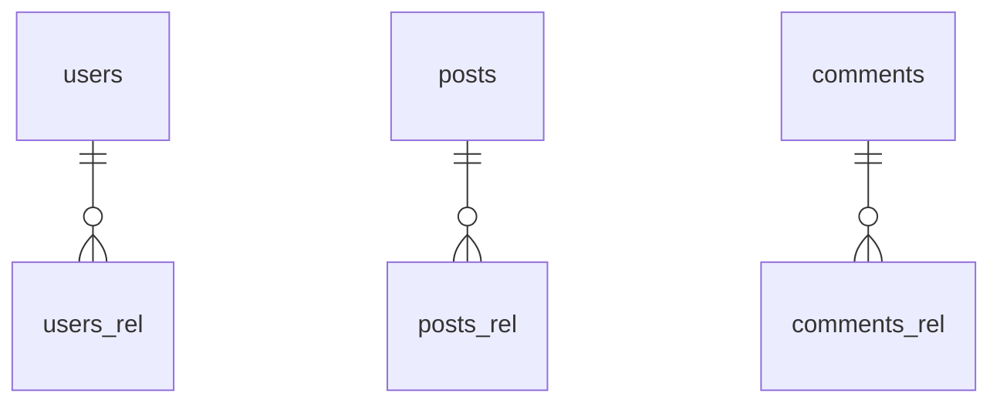

# Mermaid Edges Check

## Assertion: erDiagram has nodes users/posts/comments and edges users→posts, posts→comments

## Generated Mermaid block (from database-mapping.md)

## Analysis

### Nodes present
- `users` — PRESENT
- `posts` — PRESENT
- `comments` — PRESENT

### Edges
- `users ||--o{ posts` — ABSENT
  - Instead: `users ||--o{ users_rel` (placeholder, not a real table name)
- `posts ||--o{ comments` — ABSENT
  - Instead: `posts ||--o{ posts_rel` (placeholder, not a real table name)

## Root cause

Because `target_entity` is empty for all relationships, `generateMappingMarkdown` falls
back to generating a synthetic placeholder (`<table_name>_rel`) instead of using the
actual target table name. The edges link each table to a non-existent `*_rel` node rather
than to the actual related table.

## Grep evidence

Checking for the expected edges in database-mapping.md:
- `users ||--o{ posts` — NOT FOUND
- `posts ||--o{ comments` — NOT FOUND
- `users ||--o{ users_rel` — FOUND (line 24)
- `posts ||--o{ posts_rel` — FOUND (line 25)
- `comments ||--o{ comments_rel` — FOUND (line 26)

## Verdict

- **nodes users, posts, comments**: PARTIAL — the source nodes appear, but the target nodes
  are synthetic placeholders (`users_rel`, `posts_rel`, `comments_rel`), not real table names
- **edge users ||--o{ posts**: FAIL
- **edge posts ||--o{ comments**: FAIL
