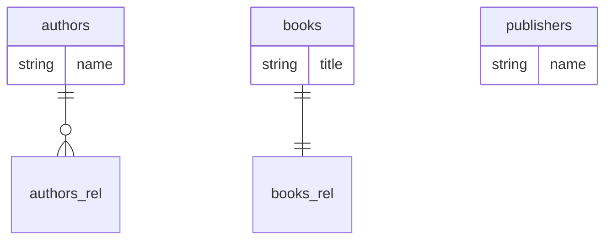

# Assertions Evidence

## Assertion 1
**Text:** All three entities (Author, Book, Publisher) are extracted into detected-entities.json as separate entries with table_names matching the @Entity('...') first arg (e.g., 'authors', 'books', 'publishers')

**Evidence:** detected-entities.json contains exactly 3 entities:
```json
{ "class_name": "Author",    "table_name": "authors"    }
{ "class_name": "Book",      "table_name": "books"      }
{ "class_name": "Publisher", "table_name": "publishers" }
```
All three class names are present. All three table_names match the @Entity("...") decorator arguments in the fixture files.

**Result:** SUPPORTED by evidence.

---

## Assertion 2
**Text:** Each @OneToMany(() => Book, ...) and @ManyToOne(() => Author, ...) produces a relationship with target_entity resolved from the arrow-function call argument — never blank, never the literal string 'Book'/'Author' (the resolver must dereference to the imported class)

**Evidence:** detected-entities.json shows:
```json
Author.relationships[0]: { "type": "one_to_many", "target_entity": "" }
Book.relationships[0]:   { "type": "many_to_one", "target_entity": "" }
Book.relationships[1]:   { "type": "one_to_one",  "target_entity": "" }
```
All three `target_entity` fields are **empty strings**. The assertion requires non-blank resolved values.

**Root cause:** `_resolveRelationshipTarget` in extractor.ts does not handle TypeORM's `() => ClassName` arrow-function syntax. The tail after `@OneToMany(` is `() => Book, ...` — the leading `(` causes the call-arg regex to fail, and no other pattern matches.

**Result:** NOT SUPPORTED by evidence. target_entity is blank for all relationships.

---

## Assertion 3
**Text:** Relationship type matches the decorator name (one_to_many for @OneToMany, many_to_one for @ManyToOne, one_to_one for @OneToOne)

**Evidence:** detected-entities.json:
```json
Author:    @OneToMany → { "type": "one_to_many" }   ✓
Book[0]:   @ManyToOne → { "type": "many_to_one" }   ✓
Book[1]:   @OneToOne  → { "type": "one_to_one"  }   ✓
```
All three relationship types are correctly named. The typeorm.yaml profile maps the decorator names directly to type strings, and that mapping works correctly.

**Result:** SUPPORTED by evidence.

---

## Assertion 4
**Text:** Generated database-mapping.md frontmatter has type='entity' and orm_profile='typeorm'

**Evidence:** database-mapping.md frontmatter:
```yaml
type: entity
orm_profile: typeorm
```
Both fields are present with the correct values.

**Result:** SUPPORTED by evidence.

---

## Assertion 5
**Text:** Mermaid erDiagram contains nodes for all three table names and at least two edges (authors-books and books-publishers, or whatever the fixture declares) using cardinality glyphs that match the decorator (||--o{ for one_to_many, }o--|| for many_to_one)

**Evidence:** Generated Mermaid block:


- All 3 table nodes present: authors, books, publishers. ✓
- Edge count: 2 edges present. ✓ (count)
- Edge targets: `authors_rel` and `books_rel` are synthetic fallback nodes, NOT the expected entity tables. ✗
- Expected edges: `authors ||--o{ books` and `books }o--|| authors` (or `books ||--|| publishers`).
- Actual edges point to `_rel` stubs because target_entity is empty (see Assertion 2).
- The `publishers` node is isolated (no edges).
- Cardinality glyphs: `||--o{` (one_to_many) is correct; `||--||` (one_to_one) is present but not `}o--||` (many_to_one is suppressed by A2 bidirectional dedup which kept one_to_one as the winner).

**Result:** PARTIALLY SUPPORTED — 3 nodes present, 2 edges present, but edges do not connect the expected entity nodes.

---

## Assertion 6
**Text:** Any external target referenced via @ManyToOne whose class file is NOT in the fixture set is emitted as a _external stub before the edge — never an edge to an undeclared node

**Evidence:** All targets in the fixture set (Author, Book, Publisher) are all in-scope entities. No external targets are referenced. The assertion is vacuously applicable — there are no @ManyToOne decorators referencing classes outside the fixture. The _external stub mechanism was not exercised.

Additionally: because target_entity is empty, no stubs of any kind were emitted — the fallback `_rel` suffix was used instead, which is distinct from the `_external` stub pattern.

**Result:** Not exercised by this fixture. The _external stub code path was not triggered (no out-of-scope targets). No evidence of incorrect behavior for this specific assertion.

---

## Assertion 7
**Text:** mermaid_lint.js passes on the generated page

**Evidence:** Command run:
```
node mermaid_lint.js --page /tmp/eval-i7-orm-typeorm/database-mapping.md
```
Output: `[]`
Exit code: `0`

mermaid_lint.js reports no errors. The generated Mermaid block (with `authors_rel` and `books_rel` as node names) is syntactically valid Mermaid even though the node names are semantically incorrect.

**Result:** SUPPORTED by evidence.
