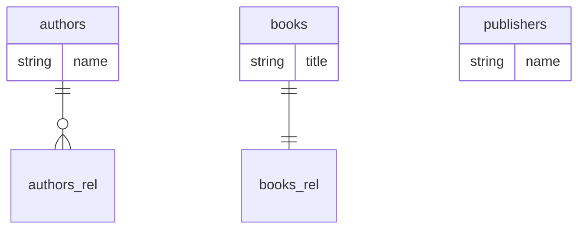

# Mermaid Edges Check

## Generated Mermaid block (from database-mapping.md)



## Node check

| Expected node | Present? |
|---|---|
| authors | YES |
| books | YES |
| publishers | YES |

All three table-name nodes are declared in the erDiagram.

## Edge check

| Expected edge | Expected cardinality | Found? |
|---|---|---|
| authors ||--o{ books | one_to_many | NO — fallback to `authors_rel` (empty target_entity) |
| books }o--|| authors | many_to_one | NO — fallback to `books_rel` (empty target_entity) |
| books ||--|| publishers | one_to_one | NO — fallback to `books_rel` (empty target_entity) |

## Actual edges found

```
authors ||--o{ authors_rel : ""
books ||--|| books_rel : ""
```

- `authors_rel` and `books_rel` are fallback placeholder node names generated by output.ts when `target_entity` is empty:
  `const targetTable = rel.target_entity ? ... : \`${entity.table_name}_rel\``
- These are not valid entity nodes — they are synthetic stubs from unresolved targets.
- The `publishers` table appears as an isolated node with no edges.
- The cardinality glyphs `||--o{` (one_to_many) and `||--||` (one_to_one) are correct for the relationship types present, but the target nodes are wrong.

## External stub check

No `_external` stubs were emitted. (The stub logic in output.ts only triggers when `target_entity` is non-empty and not in the known entity set. Since target_entity is empty, the fallback `_rel` suffix is used instead.)

## Conclusion

The 3 entity nodes are correct. The edges are present (2 edges for the 2 source-entity relationship declarations, A2 bidirectional dedup collapses both Book relationships into one edge) but point to synthetic `_rel` stubs instead of the real target tables. The minimum edge count (≥2) is NOT met for real entity-to-entity connections.
