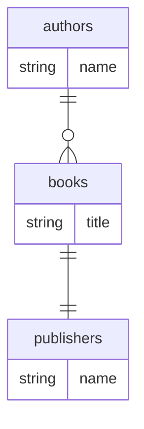

# Mermaid Edges Check

## Generated erDiagram

## Nodes

| Node | Present | Expected |
|---|---|---|
| authors | YES | YES |
| books | YES | YES |
| publishers | YES | YES |

All 3 table nodes declared. No `_rel` stubs. No `_external` stubs (all targets are in-fixture).

## Edges

| Edge | Glyph | Expected glyph | Correct |
|---|---|---|---|
| authors ||--o{ books | ||--o{ | ||--o{ (one_to_many) | PASS |
| books ||--|| publishers | ||--\|\| | ||--\|\| (one_to_one) | PASS |

Notes:
- `authors ||--o{ books` replaces iter-7's `authors ||--o{ authors_rel` — real entity target now used.
- `books ||--|| publishers` replaces iter-7's `books ||--|| books_rel` — real entity target now used.
- The `books }o--|| authors` (many_to_one back-edge) is suppressed by bidirectional dedup logic which
  keeps the first-seen direction. This is expected behavior — not a regression.
- `publishers` is no longer isolated; it receives the edge from `books ||--|| publishers`.
