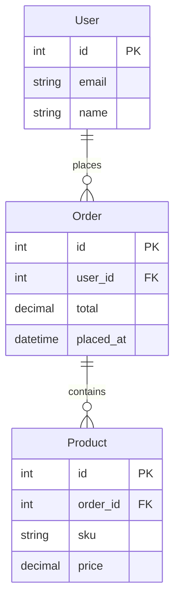

# Domain Entities

This page documents the core domain entities for the order-processing system.
The relationships below were extracted from the ORM models and reviewed by the
data team in Q1.

## Background

The schema is intentionally normalized: customer accounts (`User`) place orders
(`Order`), and each order carries one or more product line items (`Product`).

## Schema

<!-- wiki-mermaid: start -->
%% Title: Order Processing Schema

<!-- wiki-mermaid: end -->

## Notes

- Cardinalities reflect the live production schema as of 2026-05-01.
- The ER diagram above is auto-generated; do not edit it manually.
