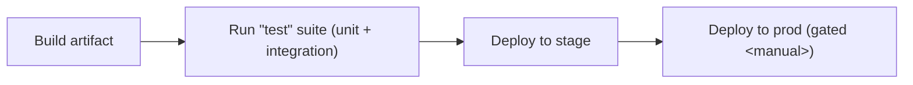

# Deploy Pipeline

This document describes the end-to-end deploy pipeline for the application.
Stages run sequentially; a failure in any stage halts the pipeline and pages
the on-call.

## Stages

The flow is: build > test > stage > prod. The "test" stage runs unit and
integration suites; tickets opened against the pipeline must reference the
failing stage.

<!-- wiki-mermaid: start -->
%% Title: Deploy Pipeline

<!-- wiki-mermaid: end -->

## Operational notes

- The `prod` stage requires a manual approval gate.
- Rollback is initiated via `make rollback` from the deploy host.
