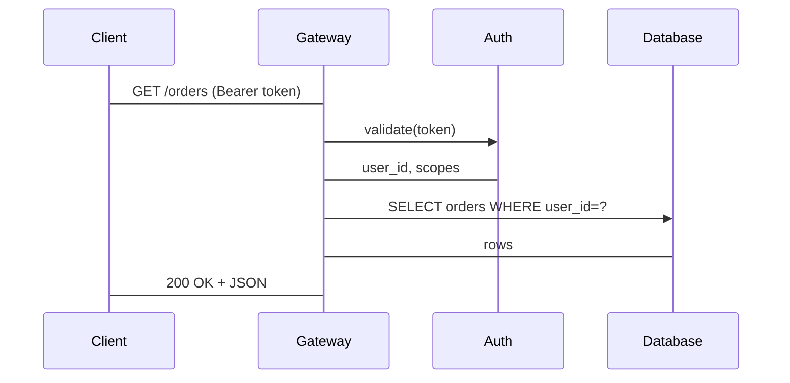

# Request Flow

This document traces a typical authenticated HTTP request through the system.
Each hop is logged with a correlation ID so the full chain is reconstructible
from the observability stack.

## Components

The request path crosses four components:

1. **Client** - browser or mobile app
2. **API Gateway** - terminates TLS, validates the bearer token shape, routes
3. **Auth Service** - verifies the token against the session store
4. **Database** - persists the resolved query

## Sequence

<!-- wiki-mermaid: start -->
%% Title: HTTP Request Flow

<!-- wiki-mermaid: end -->

## Failure modes

- Auth failures short-circuit at the gateway with a 401.
- Database timeouts surface as 503 to the client.
