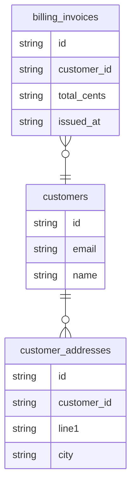

## Entity-Table Mapping

| Entity Class | Schema.Table | Columns | Relationships |
|---|---|---|---|
| Customer | customers | 3 | one_to_many |
| Address | customer_addresses | 4 | many_to_one |
| Invoice | billing_invoices | 4 | many_to_one |

## Entity Relationship Diagram

## How to Go Deeper

This page was compiled from ORM source files. Use these commands to verify or update the information against the live database:

- **Customer** (`customers`)
  - Columns: `wiki agent db-query dev "SELECT column_name, data_type FROM information_schema.columns WHERE table_name = 'customers'"`
  - Sample rows: `wiki agent db-query dev "SELECT * FROM customers LIMIT 5"`
- **Address** (`customer_addresses`)
  - Columns: `wiki agent db-query dev "SELECT column_name, data_type FROM information_schema.columns WHERE table_name = 'customer_addresses'"`
  - Sample rows: `wiki agent db-query dev "SELECT * FROM customer_addresses LIMIT 5"`
- **Invoice** (`billing_invoices`)
  - Columns: `wiki agent db-query dev "SELECT column_name, data_type FROM information_schema.columns WHERE table_name = 'billing_invoices'"`
  - Sample rows: `wiki agent db-query dev "SELECT * FROM billing_invoices LIMIT 5"`
- **Live code:** Read `/Users/narayan/src/doc-wiki/wiki-workspace/iteration-9/orm-agent-custom/work/example.py` — ORM source files this mapping was extracted from.
