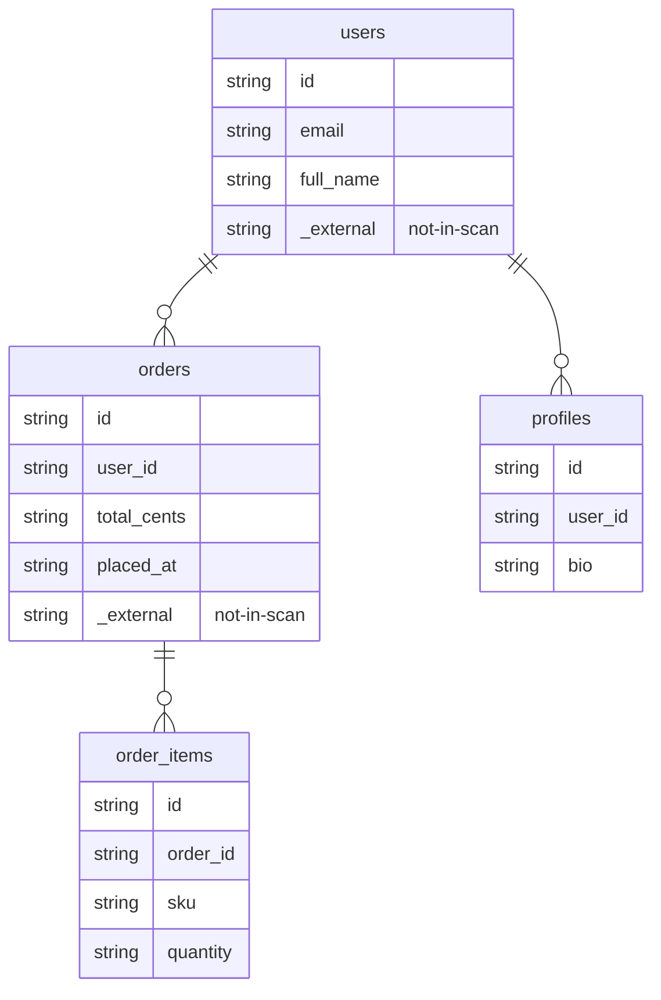

## Entity-Table Mapping

| Entity Class | Schema.Table | Columns | Relationships |
|---|---|---|---|
| User | users | 3 | relationship, relationship |
| Order | orders | 4 | relationship, relationship, foreign_key |
| OrderItem | order_items | 4 | relationship, foreign_key |
| Profile | profiles | 3 | relationship, foreign_key |

## Entity Relationship Diagram

## How to Go Deeper

This page was compiled from ORM source files. Use these commands to verify or update the information against the live database:

- **User** (`users`)
  - Columns: `wiki agent db-query dev "SELECT column_name, data_type FROM information_schema.columns WHERE table_name = 'users'"`
  - Sample rows: `wiki agent db-query dev "SELECT * FROM users LIMIT 5"`
- **Order** (`orders`)
  - Columns: `wiki agent db-query dev "SELECT column_name, data_type FROM information_schema.columns WHERE table_name = 'orders'"`
  - Sample rows: `wiki agent db-query dev "SELECT * FROM orders LIMIT 5"`
- **OrderItem** (`order_items`)
  - Columns: `wiki agent db-query dev "SELECT column_name, data_type FROM information_schema.columns WHERE table_name = 'order_items'"`
  - Sample rows: `wiki agent db-query dev "SELECT * FROM order_items LIMIT 5"`
- **Profile** (`profiles`)
  - Columns: `wiki agent db-query dev "SELECT column_name, data_type FROM information_schema.columns WHERE table_name = 'profiles'"`
  - Sample rows: `wiki agent db-query dev "SELECT * FROM profiles LIMIT 5"`
- **Live code:** Read `/Users/narayan/src/doc-wiki/wiki-workspace/iteration-9/orm-agent-sqlalchemy/work/models.py` — ORM source files this mapping was extracted from.
