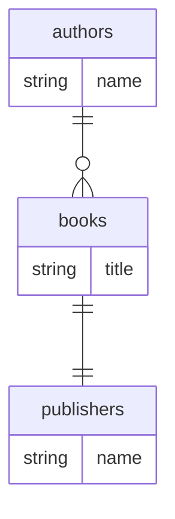

## Entity-Table Mapping

| Entity Class | Schema.Table | Columns | Relationships |
|---|---|---|---|
| Author | authors | 1 | one_to_many |
| Book | books | 1 | many_to_one, one_to_one |
| Publisher | publishers | 1 | — |

## Entity Relationship Diagram

## How to Go Deeper

This page was compiled from ORM source files. Use these commands to verify or update the information against the live database:

- **Author** (`authors`)
  - Columns: `wiki agent db-query dev "SELECT column_name, data_type FROM information_schema.columns WHERE table_name = 'authors'"`
  - Sample rows: `wiki agent db-query dev "SELECT * FROM authors LIMIT 5"`
- **Book** (`books`)
  - Columns: `wiki agent db-query dev "SELECT column_name, data_type FROM information_schema.columns WHERE table_name = 'books'"`
  - Sample rows: `wiki agent db-query dev "SELECT * FROM books LIMIT 5"`
- **Publisher** (`publishers`)
  - Columns: `wiki agent db-query dev "SELECT column_name, data_type FROM information_schema.columns WHERE table_name = 'publishers'"`
  - Sample rows: `wiki agent db-query dev "SELECT * FROM publishers LIMIT 5"`
- **Live code:** Read `/Users/narayan/src/doc-wiki/agents/wiki-orm-agent/evals/fixtures/typeorm/Author.ts`, `/Users/narayan/src/doc-wiki/agents/wiki-orm-agent/evals/fixtures/typeorm/Book.ts`, `/Users/narayan/src/doc-wiki/agents/wiki-orm-agent/evals/fixtures/typeorm/Publisher.ts` — ORM source files this mapping was extracted from.
